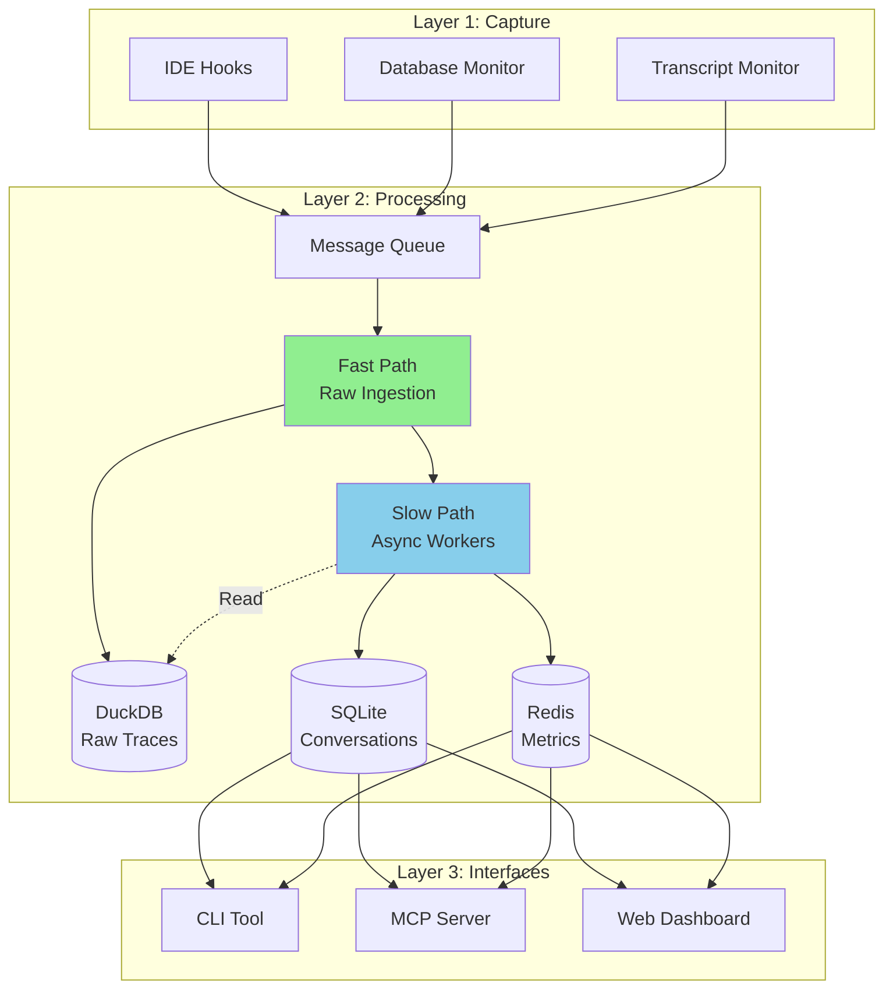
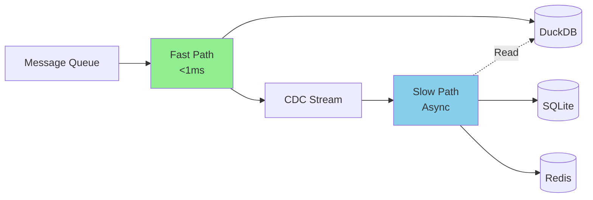
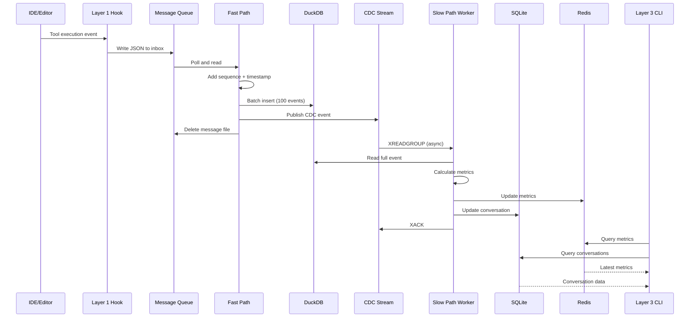

<!--
Copyright © 2025 Sierra Labs LLC
SPDX-License-Identifier: AGPL-3.0-only
License-Filename: LICENSE
-->

# Blueplane Telemetry Core Architecture

> Comprehensive architectural overview of the Blueplane Telemetry Core system

## Table of Contents

- [Executive Summary](#executive-summary)
- [System Architecture](#system-architecture)
- [Layer 1: Capture](#layer-1-capture)
- [Layer 2: Processing](#layer-2-processing)
- [Layer 3: Interfaces](#layer-3-interfaces)
- [Data Flow](#data-flow)
- [Database Architecture](#database-architecture)
- [Privacy & Security](#privacy--security)
- [Performance Characteristics](#performance-characteristics)

## Executive Summary

Blueplane Telemetry Core is a **privacy-first, local-only telemetry system** for AI-assisted coding. It captures, processes, and analyzes telemetry from platforms like Claude Code and Cursor while ensuring all data stays on your local machine.

### Design Principles

1. **Privacy-First**: No code content, no cloud transmission, all local storage
2. **Zero-Latency Ingestion**: Fast path writes with <1ms P95 latency
3. **Eventual Consistency**: Async enrichment doesn't block capture
4. **Multi-Platform**: Supports Claude Code, Cursor, and extensible to others
5. **Developer-Friendly**: Rich CLI, MCP integration, and web dashboard

## System Architecture

The system is organized into three distinct layers:



## Layer 1: Capture

Layer 1 is responsible for **capturing telemetry events** from AI coding assistants with minimal overhead.

### Components

#### 1.1 IDE Hooks

Platform-specific hooks that capture events as they happen:

**Claude Code Hooks:**

- `SessionStart`: Session initialization
- `UserPromptSubmit`: User input
- `PreToolUse` / `PostToolUse`: Tool execution
- `PreCompact`: Context window management
- `Stop`: Session termination

**Cursor Hooks:**

- `BeforeSubmitPrompt`: User prompt submission
- `AfterAgentResponse`: AI response
- `BeforeMCPExecution` / `AfterMCPExecution`: Tool calls
- `AfterFileEdit`: File modifications

#### 1.2 Database Monitor

For platforms like Cursor that store data in SQLite:

- Monitors database file changes via filesystem watcher
- Extracts relevant tables: `aiService.prompts`, `aiService.generations`, `composer.composerData`
- Converts database rows to telemetry events

#### 1.3 Transcript Monitor

For Claude Code transcript files:

- Monitors transcript JSONL files
- Extracts conversation history, model usage, token counts
- Provides rich context not available in hooks alone

### Event Format

All captured events follow a standard format:

```json
{
  "timestamp": "2025-11-09T12:34:56.789Z",
  "platform": "claude_code",
  "session_id": "sess_abc123",
  "event_type": "tool_use",
  "hook_type": "PostToolUse",
  "metadata": {
    "workspace_hash": "a1b2c3d4",
    "project_hash": "x9y8z7"
  },
  "payload": {
    "tool": "Edit",
    "success": true,
    "duration_ms": 145
  }
}
```

### Delivery Mechanism

Events are written to a **file-based message queue**:

```
~/.blueplane/mq/
├── inbox/          # New events
│   ├── 001.json
│   ├── 002.json
│   └── ...
└── dlq/            # Failed events
    └── error_*.json
```

**Benefits:**

- Atomic writes prevent partial messages
- Automatic retry via filesystem
- No network dependency
- Simple and reliable

[**Full Specification →**](./architecture/layer1_capture.md)

## Layer 2: Processing

Layer 2 implements a **high-performance async pipeline** with separate fast and slow processing paths.

### Architecture Pattern: Fast Path / Slow Path



### Fast Path: Zero-Latency Ingestion

**Goal:** Write raw events with zero blocking (<1ms P95)

**Implementation:**

1. **Poll** message queue (non-blocking)
2. **Read** and parse JSON events
3. **Add** sequence number and timestamp
4. **Batch** events (100 events or 100ms timeout)
5. **Write** to DuckDB in single batch
6. **Publish** CDC events to Redis Streams
7. **Delete** message files

**Key Characteristics:**

- Zero database reads (pure writes)
- Batched for efficiency
- Fire-and-forget CDC publishing
- Errors logged but don't block

### Slow Path: Async Enrichment

**Goal:** Calculate metrics and build conversations without blocking ingestion

**Worker Types:**

1. **Metrics Workers** (2-4 workers)

   - Calculate acceptance rates, latency percentiles
   - Update real-time metrics in Redis
   - Priority: user events, tool execution

2. **Conversation Workers** (2-4 workers)

   - Reconstruct conversation structure
   - Track code changes and acceptance
   - Store in SQLite with relationships

3. **AI Insights Workers** (1-2 workers)
   - Generate insights from patterns
   - Suggest workflow improvements
   - Lowest priority (doesn't block core metrics)

**Processing Pattern:**

1. **Consume** from CDC Redis Stream (XREADGROUP)
2. **Read** full event from DuckDB by sequence
3. **Enrich** with context from other databases
4. **Calculate** metrics or update conversations
5. **Write** to SQLite/Redis
6. **Acknowledge** CDC event (XACK)

[**Full Specification →**](./architecture/layer2_async_pipeline.md)

## Layer 3: Interfaces

Layer 3 provides **multiple interfaces** for accessing telemetry data. Importantly, Layer 3 only accesses **processed data** from SQLite and Redis, never raw traces from DuckDB.

### 3.1 CLI Interface

Rich terminal interface for quick access to metrics:

```bash
# Current session metrics
$ blueplane metrics
┏━━━━━━━━━━━━━━━━━━┳━━━━━━━━━┳━━━━━━━━┓
┃ Metric           ┃ Value   ┃ Change ┃
┡━━━━━━━━━━━━━━━━━━╇━━━━━━━━━╇━━━━━━━━┩
│ Acceptance Rate  │ 78.3%   │ +2.1%  │
│ Productivity     │ 145     │ +12    │
│ Error Rate       │ 3.2%    │ -0.5%  │
└──────────────────┴─────────┴────────┘

# Session analysis
$ blueplane analyze sess_abc123

# Export data
$ blueplane export -f csv -o metrics.csv
```

**Features:**

- Beautiful tables with Rich
- ASCII charts with Plotext
- JSON/CSV/Markdown export
- Real-time streaming with WebSocket

[**Full Specification →**](./architecture/layer3_cli_interface.md)

### 3.2 MCP Server

Enable AI assistants to become **telemetry-aware** through Model Context Protocol:

**Tool Categories:**

- **Metrics**: Query current and historical metrics
- **Analysis**: Analyze patterns and acceptance rates
- **Search**: Find similar tasks from history
- **Optimization**: Predict acceptance, optimize context
- **Tracking**: Track decisions and log outcomes

**Example Usage:**

```python
# AI assistant can query its own performance
metrics = await mcp.get_current_metrics()
if metrics["acceptance_rate"] < 0.5:
    insights = await mcp.get_contextual_insights()
    # Adjust generation strategy
```

[**Full Specification →**](./architecture/layer3_mcp_server.md)

### 3.3 Web Dashboard

Real-time visualization and analytics (Phase 2):

- Real-time metrics cards
- Session timeline visualization
- Acceptance rate trends
- Tool usage heatmaps
- AI-powered insights panel

[**Full Specification →**](./architecture/layer3_local_dashboard.md)

## Data Flow

### End-to-End Event Flow



### Data Isolation

**Important:** Raw traces in DuckDB are **Layer 2 internal only**:

- ✅ Layer 2 fast path **writes** to DuckDB
- ✅ Layer 2 slow path **reads** from DuckDB for enrichment
- ❌ Layer 3 interfaces **never access** DuckDB
- ✅ Layer 3 accesses only **processed data** (SQLite + Redis)

This ensures:

- Privacy: Raw events stay internal to processing layer
- Performance: Layer 3 doesn't slow down ingestion
- Simplicity: Clean API boundaries

## Database Architecture

### Storage Technology Selection

| Database   | Purpose           | Access       | Rationale                                |
| ---------- | ----------------- | ------------ | ---------------------------------------- |
| **DuckDB** | Raw traces        | Layer 2 only | In-process OLAP, columnar, SQL analytics |
| **SQLite** | Conversations     | Layer 2 & 3  | Embedded, ACID, relational structure     |
| **Redis**  | Real-time metrics | Layer 2 & 3  | Sub-ms latency, time-series, pub/sub     |

### DuckDB: Raw Trace Storage

**Schema:**

```sql
CREATE TABLE raw_traces (
    sequence BIGINT PRIMARY KEY,
    timestamp TIMESTAMP NOT NULL,
    ingested_at TIMESTAMP NOT NULL,
    platform TEXT NOT NULL,
    session_id TEXT NOT NULL,
    event_type TEXT NOT NULL,
    payload JSON,
    metadata JSON,
    -- Indexes for fast queries
    INDEX idx_session (session_id, timestamp),
    INDEX idx_type (event_type, timestamp)
);
```

**Characteristics:**

- Columnar storage for analytics
- ZSTD compression (10:1 ratio)
- Fast analytical queries
- Auto-archival to Parquet after 7 days

### SQLite: Conversation Storage

**Schema:**

```sql
CREATE TABLE conversations (
    id TEXT PRIMARY KEY,
    session_id TEXT NOT NULL,
    platform TEXT NOT NULL,
    created_at TIMESTAMP,
    interaction_count INTEGER,
    acceptance_rate REAL,
    total_lines_added INTEGER,
    total_lines_removed INTEGER
);

CREATE TABLE conversation_turns (
    id TEXT PRIMARY KEY,
    conversation_id TEXT,
    turn_number INTEGER,
    turn_type TEXT,
    content_hash TEXT,
    tokens_used INTEGER,
    latency_ms INTEGER,
    FOREIGN KEY (conversation_id) REFERENCES conversations(id)
);

CREATE TABLE code_changes (
    id TEXT PRIMARY KEY,
    conversation_id TEXT,
    turn_id TEXT,
    file_extension TEXT,
    operation TEXT,
    lines_added INTEGER,
    lines_removed INTEGER,
    accepted BOOLEAN,
    acceptance_delay_ms INTEGER,
    FOREIGN KEY (conversation_id) REFERENCES conversations(id)
);
```

**Characteristics:**

- Normalized relational structure
- ACID transactions
- Full-text search capable
- ~10MB typical size

### Redis: Real-Time Metrics

**Data Structures:**

- **TimeSeries**: Metrics with automatic downsampling
- **Streams**: CDC event distribution
- **Hash**: Latest metric snapshots
- **Sorted Sets**: Leaderboards and rankings

**Retention Policies:**

- 1-hour: Raw time-series data
- 1-day: 1-minute aggregations
- 7-day: 5-minute aggregations
- 30-day: 1-hour aggregations

[**Full Database Specification →**](./architecture/database_architecture_detailed.md)

## Privacy & Security

### Privacy Guarantees

**Data Never Captured:**

- ❌ Source code content
- ❌ File paths (only extensions)
- ❌ User prompt text (only metadata)
- ❌ Personal identifiable information
- ❌ API keys or credentials

**Data Captured (Privacy-Safe):**

- ✅ Timing metrics
- ✅ Tool usage patterns
- ✅ File extensions
- ✅ Accept/reject events
- ✅ Model information
- ✅ Session metadata

### Security Measures

1. **Local-Only Storage**: All data stays on your machine
2. **No Network Transmission**: Zero telemetry sent to cloud
3. **Content Hashing**: Sensitive data hashed with SHA256
4. **Access Control**: Layer 3 cannot access raw traces
5. **Opt-Out**: Easy disable for any metric category

### Data Ownership

- You own all captured data
- Delete data anytime with `blueplane purge`
- Export data with `blueplane export`
- No vendor lock-in

## Performance Characteristics

### Latency Targets

| Component     | Operation                | P50   | P95  | P99   |
| ------------- | ------------------------ | ----- | ---- | ----- |
| **Fast Path** | Event ingestion          | 0.5ms | 1ms  | 2ms   |
| **Fast Path** | Batch write (100 events) | 2ms   | 5ms  | 10ms  |
| **Slow Path** | Metrics calculation      | 5ms   | 20ms | 50ms  |
| **Slow Path** | Conversation update      | 10ms  | 50ms | 100ms |
| **Layer 3**   | CLI query                | 10ms  | 50ms | 100ms |

### Throughput Targets

| Metric                    | Target  | Notes            |
| ------------------------- | ------- | ---------------- |
| Fast path events/sec      | 10,000  | Single consumer  |
| DuckDB writes/sec         | 100,000 | Batched inserts  |
| Redis metrics updates/sec | 1,000   | 2 workers        |
| CLI queries/sec           | 100     | Concurrent users |

### Resource Usage

| Resource       | Baseline | Under Load | Notes                  |
| -------------- | -------- | ---------- | ---------------------- |
| Memory         | 50MB     | 200MB      | Includes all databases |
| Disk (active)  | 10MB     | 100MB      | 7-day retention        |
| Disk (archive) | 0MB      | 1GB/month  | Compressed Parquet     |
| CPU            | <1%      | <5%        | Async processing       |

## Deployment Patterns

### Single Developer

```bash
# Local installation
blueplane install claude-code
blueplane start

# Background service
systemctl --user enable blueplane
systemctl --user start blueplane
```

### Team Setup (Privacy-Preserved)

```bash
# Individual installation (same as single developer)
blueplane install cursor

# Optional: Export anonymized metrics for team dashboard
blueplane export --anonymize -o team_metrics.json

# Team lead aggregates anonymized exports
blueplane team aggregate *.json --output team_dashboard.json
```

**Privacy Note:** Team aggregation works only on anonymized exports with no identifying information.

## Technology Stack

### Languages & Frameworks

- **Python 3.11+**: Core system implementation
- **TypeScript**: Web dashboard (React)
- **Bash**: Installation scripts

### Dependencies

**Core:**

- `duckdb`: Analytical database
- `sqlite3`: Relational database (built-in)
- `redis`: Real-time metrics and queuing
- `asyncio`: Async event processing
- `httpx`: HTTP client
- `fastapi`: REST API server

**CLI:**

- `rich`: Terminal UI
- `plotext`: ASCII charts
- `click`: CLI framework

**MCP Server:**

- `mcp`: Model Context Protocol
- `pydantic`: Data validation
- `numpy`: Numerical operations
- `scikit-learn`: ML features

## Future Enhancements

### Phase 2: Enhanced Analytics

- Advanced pattern recognition with ML
- Predictive acceptance forecasting
- Workflow optimization suggestions
- Custom metric plugins

### Phase 3: Ecosystem Expansion

- GitHub Copilot integration
- JetBrains IDE support
- VS Code extension (direct capture)
- Optional cloud sync (encrypted)

### Phase 4: Team Features

- Team dashboards (privacy-preserved)
- Comparative analytics
- Best practice recommendations
- Knowledge base from patterns

## Related Documentation

- [Layer 1 Capture Specification](./architecture/layer1_capture.md)
- [Layer 2 Async Pipeline Specification](./architecture/layer2_async_pipeline.md)
- [Layer 2 Conversation Reconstruction](./architecture/layer2_conversation_reconstruction.md)
- [Layer 2 Metrics Derivation](./architecture/layer2_metrics_derivation.md)
- [Layer 3 CLI Interface](./architecture/layer3_cli_interface.md)
- [Layer 3 MCP Server](./architecture/layer3_mcp_server.md)
- [Layer 3 Web Dashboard](./architecture/layer3_local_dashboard.md)
- [Database Architecture](./architecture/layer2_db_architecture.md)

---

**Questions or feedback?** Refer to the project documentation and team discussions.
