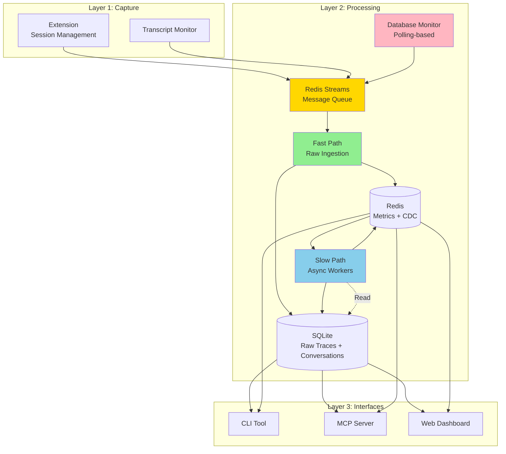
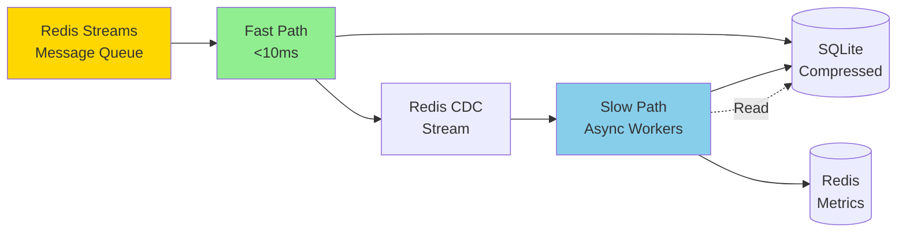
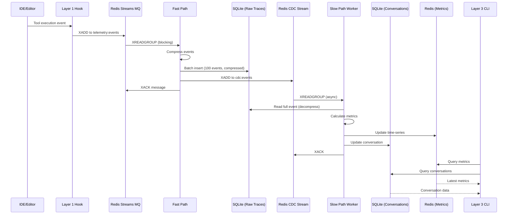

<!--
Copyright © 2025 Sierra Labs LLC
SPDX-License-Identifier: AGPL-3.0-only
License-Filename: LICENSE
-->

# Blueplane Telemetry Core Architecture

> Comprehensive architectural overview of the Blueplane Telemetry Core system

## Table of Contents

- [Executive Summary](#executive-summary)
- [System Architecture](#system-architecture)
- [Layer 1: Capture](#layer-1-capture)
- [Layer 2: Processing](#layer-2-processing)
- [Layer 3: Interfaces](#layer-3-interfaces)
- [Data Flow](#data-flow)
- [Database Architecture](#database-architecture)
- [Privacy & Security](#privacy--security)
- [Performance Characteristics](#performance-characteristics)

## Executive Summary

Blueplane Telemetry Core is a **privacy-first, local-only telemetry system** for AI-assisted coding. It captures, processes, and analyzes telemetry from platforms like Claude Code and Cursor while ensuring all data stays on your local machine.

### Design Principles

1. **Privacy-First**: No code content, no cloud transmission, all local storage
2. **Low-Latency Ingestion**: Fast path writes with <10ms P95 latency (compressed batches)
3. **Eventual Consistency**: Async enrichment doesn't block capture
4. **Multi-Platform**: Supports Claude Code, Cursor, and extensible to others
5. **Developer-Friendly**: Rich CLI, MCP integration, and web dashboard

## System Architecture

The system is organized into three distinct layers:



## Layer 1: Capture

Layer 1 is responsible for **capturing telemetry events** from AI coding assistants with minimal overhead.

### Components

#### 1.1 Database Monitor

For platforms like Cursor that store data in SQLite:

- **Location**: Python processing server (`src/processing/cursor/database_monitor.py`)
- Monitors database changes via polling (every 30 seconds by default)
- Reads from `ItemTable` key-value pairs: `aiService.generations` and `aiService.prompts` (stored as JSON arrays)
- Converts database data to telemetry events
- Note: Database monitoring runs in Layer 2 (processing server), not Layer 1 (extension)

#### 1.2 Transcript Monitor

For Claude Code transcript files:

- Monitors transcript JSONL files
- Extracts conversation history, model usage, token counts
- Provides rich context for Claude Code sessions

### Event Format

All captured events follow a standard format:

```json
{
  "timestamp": "2025-11-09T12:34:56.789Z",
  "platform": "claude_code",
  "session_id": "sess_abc123",
  "event_type": "tool_use",
  "hook_type": "PostToolUse",
  "metadata": {
    "workspace_hash": "a1b2c3d4",
    "project_hash": "x9y8z7"
  },
  "payload": {
    "tool": "Edit",
    "success": true,
    "duration_ms": 145
  }
}
```

### Delivery Mechanism

Events are written to **Redis Streams**:

```
Redis Stream: "telemetry:events"
  Consumer Group: "processors"
    Consumers: fast-path-1, fast-path-2, ...

DLQ Stream: "telemetry:dlq"  # Failed events after max retries
```

**Benefits:**

- At-least-once delivery with Pending Entries List (PEL)
- Automatic retry via XCLAIM for stuck messages
- Consumer groups for distributed processing
- Built-in observability (XINFO, XPENDING)
- 100x throughput vs file-based queue

[**Full Specification →**](./architecture/layer1_capture.md)

## Layer 2: Processing

Layer 2 implements a **high-performance async pipeline** with separate fast and slow processing paths.

### Architecture Pattern: Fast Path / Slow Path



### Fast Path: Low-Latency Ingestion

**Goal:** Write raw events with minimal blocking (<10ms P95)

**Implementation:**

1. **Read** from Redis Streams (XREADGROUP with blocking)
2. **Extract** and parse JSON events
3. **Compress** event payloads with zlib
4. **Batch** events (100 events or 100ms timeout)
5. **Write** to SQLite in single batch (compressed)
6. **Publish** CDC events to Redis CDC Stream
7. **Acknowledge** messages (XACK)

**Key Characteristics:**

- Zero database reads (pure writes to SQLite)
- zlib compression (7-10x storage savings)
- Batched for efficiency
- Fire-and-forget CDC publishing
- Automatic retry via Pending Entries List (PEL)
- Errors logged but don't block ingestion

### Slow Path: Async Enrichment

**Goal:** Calculate metrics and build conversations without blocking ingestion

**Worker Types:**

1. **Metrics Workers** (2-4 workers)

   - Calculate acceptance rates, latency percentiles
   - Update real-time metrics in Redis
   - Priority: user events, tool execution

2. **Conversation Workers** (2-4 workers)

   - Reconstruct conversation structure
   - Track code changes and acceptance
   - Store in SQLite with relationships

3. **AI Insights Workers** (1-2 workers)
   - Generate insights from patterns
   - Suggest workflow improvements
   - Lowest priority (doesn't block core metrics)

**Processing Pattern:**

1. **Consume** from CDC Redis Stream (XREADGROUP)
2. **Read** full event from SQLite by sequence (decompress)
3. **Enrich** with context from same SQLite database
4. **Calculate** metrics or update conversations
5. **Write** to SQLite (conversations) or Redis (metrics)
6. **Acknowledge** CDC event (XACK)

[**Full Specification →**](./architecture/layer2_async_pipeline.md)

## Layer 3: Interfaces

Layer 3 provides **multiple interfaces** for accessing telemetry data. Layer 3 primarily accesses **processed data** from SQLite (conversations) and Redis (metrics).

### 3.1 CLI Interface

Rich terminal interface for quick access to metrics:

```bash
# Current session metrics
$ blueplane metrics
┏━━━━━━━━━━━━━━━━━━┳━━━━━━━━━┳━━━━━━━━┓
┃ Metric           ┃ Value   ┃ Change ┃
┡━━━━━━━━━━━━━━━━━━╇━━━━━━━━━╇━━━━━━━━┩
│ Acceptance Rate  │ 78.3%   │ +2.1%  │
│ Productivity     │ 145     │ +12    │
│ Error Rate       │ 3.2%    │ -0.5%  │
└──────────────────┴─────────┴────────┘

# Session analysis
$ blueplane analyze sess_abc123

# Export data
$ blueplane export -f csv -o metrics.csv
```

**Features:**

- Beautiful tables with Rich
- ASCII charts with Plotext
- JSON/CSV/Markdown export
- Real-time streaming with WebSocket

[**Full Specification →**](./architecture/layer3_cli_interface.md)

### 3.2 MCP Server

Enable AI assistants to become **telemetry-aware** through Model Context Protocol:

**Tool Categories:**

- **Metrics**: Query current and historical metrics
- **Analysis**: Analyze patterns and acceptance rates
- **Search**: Find similar tasks from history
- **Optimization**: Predict acceptance, optimize context
- **Tracking**: Track decisions and log outcomes

**Example Usage:**

```python
# AI assistant can query its own performance
metrics = await mcp.get_current_metrics()
if metrics["acceptance_rate"] < 0.5:
    insights = await mcp.get_contextual_insights()
    # Adjust generation strategy
```

[**Full Specification →**](./architecture/layer3_mcp_server.md)

### 3.3 Web Dashboard

Real-time visualization and analytics:

- **Real-time updates** via WebSocket (100ms latency)
- Live metrics cards (acceptance rate, productivity)
- Session timeline visualization
- Acceptance rate trends over time
- Tool usage heatmaps
- AI-powered insights panel

**Technology:** React + WebSocket for live updates from SQLite + Redis

[**Full Specification →**](./architecture/layer3_local_dashboard.md)

## Data Flow

### End-to-End Event Flow



### Data Isolation

**Important:** Raw traces in SQLite's platform-specific raw traces tables:

- ✅ Layer 2 fast path **writes** to platform-specific tables (cursor_raw_traces, claude_raw_traces)
- ✅ Layer 2 slow path **reads** from these tables for enrichment
- ✅ Layer 3 primarily accesses **processed data** (SQLite conversations + Redis metrics)

This design provides:

- Privacy: Raw events primarily internal to processing layer
- Performance: Optimized access patterns for each layer
- Simplicity: Clear API boundaries
- Single database: All data in one file

## Database Architecture

### Storage Technology Selection

| Database   | Purpose                      | Access       | Rationale                                    |
| ---------- | ---------------------------- | ------------ | -------------------------------------------- |
| **SQLite** | Platform-specific raw traces + Conversations | Layer 2 & 3* | Embedded, ACID, single file, zlib compression, separate tables per platform |
| **Redis**  | Message queue + Real-time metrics | Layer 2 & 3  | Streams for MQ, TimeSeries for metrics, CDC  |

_* Layer 3 only accesses conversation tables, not platform-specific raw traces tables (cursor_raw_traces, claude_raw_traces)_

### SQLite: Raw Trace Storage (Layer 2 Internal)

**Database**: `~/.blueplane/telemetry.db`

**Schema:**

```sql
-- Enable WAL mode for concurrent access
PRAGMA journal_mode=WAL;
PRAGMA synchronous=NORMAL;

-- Platform-specific raw traces tables
-- Example: Cursor raw traces
CREATE TABLE cursor_raw_traces (
    sequence INTEGER PRIMARY KEY AUTOINCREMENT,
    ingested_at TIMESTAMP DEFAULT CURRENT_TIMESTAMP,

    -- Event identification
    event_id TEXT NOT NULL,
    external_session_id TEXT,
    event_type TEXT NOT NULL,
    timestamp TIMESTAMP NOT NULL,

    -- Source location metadata
    storage_level TEXT NOT NULL,
    workspace_hash TEXT NOT NULL,
    database_table TEXT NOT NULL,
    item_key TEXT NOT NULL,

    -- Cursor-specific fields
    generation_uuid TEXT,
    composer_id TEXT,
    bubble_id TEXT,

    -- Context (indexed for fast filtering)
    model TEXT,
    tool_name TEXT,

    -- Denormalized metrics
    duration_ms INTEGER,
    tokens_used INTEGER,
    lines_added INTEGER,
    lines_removed INTEGER,

    -- Full event (zlib-compressed JSON blob)
    event_data BLOB NOT NULL,

    -- Computed columns
    event_date DATE GENERATED ALWAYS AS (DATE(timestamp)),
    event_hour INTEGER GENERATED ALWAYS AS (CAST(strftime('%H', timestamp) AS INTEGER))
);

CREATE INDEX idx_cursor_session_time ON cursor_raw_traces(external_session_id, timestamp);
CREATE INDEX idx_cursor_event_type ON cursor_raw_traces(event_type, timestamp);
CREATE INDEX idx_cursor_date_hour ON cursor_raw_traces(event_date, event_hour);

-- Similar table exists for Claude Code: claude_raw_traces
-- See docs/CLAUDE_JSONL_SCHEMA.md for Claude Code schema
```

**Note**: Cursor's database (`state.vscdb`) uses a different schema with `ItemTable` key-value pairs. The database monitor reads `aiService.generations` and `aiService.prompts` as JSON arrays from `ItemTable`, not as SQL tables.

**Characteristics:**

- zlib compression level 6 (7-10x compression ratio)
- WAL mode for concurrent read/write
- Same database file as conversations (table isolation)
- Auto-archival to Parquet after 90 days (configurable retention)
- Performance: <10ms P95 for 100-event batch insert

### SQLite: Conversation Storage (Layer 2 & Layer 3)

**Database**: `~/.blueplane/telemetry.db` (same file as raw traces)

**Schema Design:**

> **📘 See [SESSION_CONVERSATION_SCHEMA.md](./SESSION_CONVERSATION_SCHEMA.md) for complete schema design, rationale, and migration strategy.**

The schema handles platform differences:
- **Claude Code**: Sessions and conversations are 1:1 (no separate session concept)
- **Cursor**: Sessions represent IDE windows, which can contain multiple conversations

```sql
-- Cursor Sessions (Cursor only - Claude has no session concept)
CREATE TABLE cursor_sessions (
    id TEXT PRIMARY KEY,
    external_session_id TEXT NOT NULL UNIQUE,
    workspace_hash TEXT NOT NULL,
    workspace_name TEXT,
    workspace_path TEXT,
    started_at TIMESTAMP NOT NULL,
    ended_at TIMESTAMP,
    metadata TEXT DEFAULT '{}'
);

-- Conversations (unified for both platforms)
CREATE TABLE conversations (
    id TEXT PRIMARY KEY,
    session_id TEXT,  -- NULL for Claude, references cursor_sessions.id for Cursor
    external_id TEXT NOT NULL,  -- Platform-specific external ID
    platform TEXT NOT NULL,
    workspace_hash TEXT,
    workspace_name TEXT,
    started_at TIMESTAMP NOT NULL,
    ended_at TIMESTAMP,
    -- ... metrics and JSON fields ...
    FOREIGN KEY (session_id) REFERENCES cursor_sessions(id),
    CHECK (
        (platform = 'cursor' AND session_id IS NOT NULL) OR
        (platform = 'claude_code' AND session_id IS NULL)
    ),
    UNIQUE(external_id, platform)
);
```

**Characteristics:**

- Normalized relational structure
- ACID transactions
- Platform-aware schema (sessions only for Cursor)
- Full-text search capable
- ~10MB typical size

### Redis: Message Queue, CDC, and Metrics

**Data Structures:**

- **Streams (MQ)**: `telemetry:events` - Main message queue with consumer groups
- **Streams (DLQ)**: `telemetry:dlq` - Dead letter queue for failed messages
- **Streams (CDC)**: `cdc:events` - Change data capture for worker coordination
- **TimeSeries**: Metrics with automatic downsampling
- **Hash**: Latest metric snapshots
- **Sorted Sets**: Leaderboards and rankings

**Message Queue Streams:**

```
Stream: telemetry:events (main queue)
  - Consumer Group: processors
  - Max Length: ~10,000 (approximate trim)
  - Retention: Until processed + 1 hour

Stream: telemetry:dlq (dead letter queue)
  - No consumer groups
  - Retention: 7 days for debugging

Stream: cdc:events (change data capture)
  - Consumer Group: workers
  - Max Length: ~10,000
  - Retention: Until processed
```

**Metrics Retention Policies:**

- 1-hour: Raw time-series data (1-second granularity)
- 1-day: 1-minute aggregations
- 7-day: 5-minute aggregations
- 30-day: 1-hour aggregations

[**Full Database Specification →**](./architecture/database_architecture_detailed.md)

## Privacy & Security

### Privacy Guarantees

**Data Never Captured:**

- ❌ Source code content
- ❌ File paths (only extensions)
- ❌ User prompt text (only metadata)
- ❌ Personal identifiable information
- ❌ API keys or credentials

**Data Captured (Privacy-Safe):**

- ✅ Timing metrics
- ✅ Tool usage patterns
- ✅ File extensions
- ✅ Accept/reject events
- ✅ Model information
- ✅ Session metadata

### Security Measures

1. **Local-Only Storage**: All data stays on your machine
2. **No Network Transmission**: Zero telemetry sent to cloud
3. **Content Hashing**: Sensitive data hashed with SHA256
4. **Access Control**: Layer 3 cannot access raw traces
5. **Opt-Out**: Easy disable for any metric category

### Data Ownership

- You own all captured data
- Delete data anytime with `blueplane purge`
- Export data with `blueplane export`
- No vendor lock-in

## Performance Characteristics

### Latency Targets

| Component     | Operation                | P50   | P95   | P99   |
| ------------- | ------------------------ | ----- | ----- | ----- |
| **Fast Path** | Redis XADD (enqueue)     | 0.5ms | 1ms   | 2ms   |
| **Fast Path** | Batch write (100 events) | 5ms   | 8ms   | 15ms  |
| **Slow Path** | Metrics calculation      | 5ms   | 20ms  | 50ms  |
| **Slow Path** | Conversation update      | 10ms  | 50ms  | 100ms |
| **Layer 3**   | CLI query                | 10ms  | 50ms  | 100ms |
| **Layer 3**   | WebSocket update         | 50ms  | 100ms | 200ms |

### Throughput Targets

| Metric                    | Target  | Notes                     |
| ------------------------- | ------- | ------------------------- |
| Fast path events/sec      | 10,000  | Single consumer           |
| SQLite writes/sec         | 10,000  | Batched inserts (WAL mode) |
| Redis Streams writes/sec  | 100,000 | Message queue enqueue     |
| Redis metrics updates/sec | 1,000   | 2-4 workers               |
| CLI queries/sec           | 100     | Concurrent users          |

### Resource Usage

| Resource       | Baseline | Under Load | Notes                         |
| -------------- | -------- | ---------- | ----------------------------- |
| Memory         | 90MB     | 200MB      | Redis (70MB) + SQLite (20MB)  |
| Disk (active)  | 14MB     | 140MB      | 7-day retention (compressed)  |
| Disk (archive) | 0MB      | 1GB/month  | Compressed Parquet            |
| CPU            | <1%      | <5%        | Async processing              |
| Processes      | 1        | 1          | Redis daemon only (embedded SQLite) |

## Deployment Patterns

### Single Developer

```bash
# Local installation
blueplane install claude-code
blueplane start

# Background service
systemctl --user enable blueplane
systemctl --user start blueplane
```

### Team Setup (Privacy-Preserved)

```bash
# Individual installation (same as single developer)
blueplane install cursor

# Optional: Export anonymized metrics for team dashboard
blueplane export --anonymize -o team_metrics.json

# Team lead aggregates anonymized exports
blueplane team aggregate *.json --output team_dashboard.json
```

**Privacy Note:** Team aggregation works only on anonymized exports with no identifying information.

## Technology Stack

### Languages & Frameworks

- **Python 3.11+**: Core system implementation
- **TypeScript**: Web dashboard (React)
- **Bash**: Installation scripts

### Dependencies

**Core:**

- `sqlite3`: Embedded database for raw traces + conversations (Python stdlib)
- `redis`: Message queue (Streams) + real-time metrics (TimeSeries)
- `pyarrow`: Parquet archival only
- `asyncio`: Async event processing
- `httpx`: HTTP client
- `fastapi`: REST API server + WebSocket support

**CLI:**

- `rich`: Terminal UI
- `plotext`: ASCII charts
- `click`: CLI framework

**MCP Server:**

- `mcp`: Model Context Protocol
- `pydantic`: Data validation
- `numpy`: Numerical operations
- `scikit-learn`: ML features (optional)

## Future Enhancements

### Phase 2: Enhanced Analytics

- Advanced pattern recognition with ML
- Predictive acceptance forecasting
- Workflow optimization suggestions
- Custom metric plugins

### Phase 3: Ecosystem Expansion

- GitHub Copilot integration
- JetBrains IDE support
- VS Code extension (direct capture)
- Optional cloud sync (encrypted)

### Phase 4: Team Features

- Team dashboards (privacy-preserved)
- Comparative analytics
- Best practice recommendations
- Knowledge base from patterns

## Related Documentation

- [Layer 1 Capture Specification](./architecture/layer1_capture.md)
- [Layer 2 Async Pipeline Specification](./architecture/layer2_async_pipeline.md)
- [Layer 2 Conversation Reconstruction](./architecture/layer2_conversation_reconstruction.md)
- [Layer 2 Metrics Derivation](./architecture/layer2_metrics_derivation.md)
- [Layer 3 CLI Interface](./architecture/layer3_cli_interface.md)
- [Layer 3 MCP Server](./architecture/layer3_mcp_server.md)
- [Layer 3 Web Dashboard](./architecture/layer3_local_dashboard.md)
- [Database Architecture](./architecture/layer2_db_architecture.md)
- [Session & Conversation Schema Design](./SESSION_CONVERSATION_SCHEMA.md)

---

**Questions or feedback?** Refer to the project documentation and team discussions.
