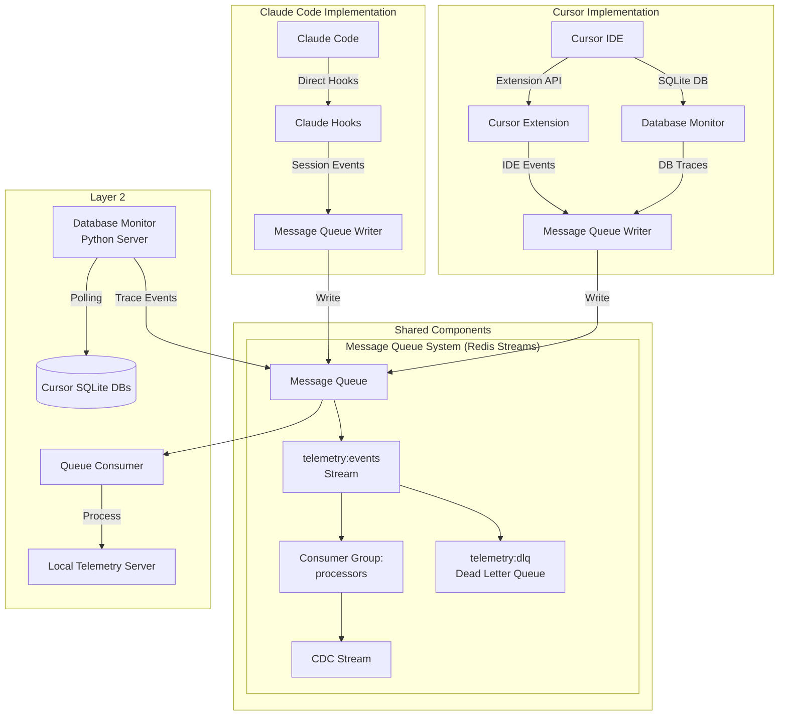

<!--
Copyright © 2025 Sierra Labs LLC
SPDX-License-Identifier: AGPL-3.0-only
License-Filename: LICENSE
-->

# Layer 1: Open Source Capture

> Part of the Blueplane MVP Architecture
> [Back to Main Architecture](./BLUEPLANE_MVP_ARCHITECTURE.md)

---

## Overview

The capture layer is a lightweight telemetry collection system that runs within the IDE environment. It consists of hooks and extensions that emit events to a message queue for processing by Layer 2 (Local Telemetry Server).

**Key Principles**:
- **No project-level storage** - Layer 1 only emits events to message queue
- **Message queue pattern** - Asynchronous, reliable event delivery
- **External session IDs** - Preserves platform-native session identifiers
- **Stateless hooks** - All state managed by extensions via environment variables
- **Platform-specific capture** - Different hooks and trace mechanisms per IDE

## Architecture



## Shared Components

### 1.1 Message Queue System (Redis Streams)

**Technology**: Redis Streams

**Stream Structure**:
```
Main Queue: telemetry:events
  - Consumer Group: processors
  - Max Length: ~10,000 (approximate trim)
  - Consumers: fast-path-1, fast-path-2, ...

Dead Letter Queue: telemetry:dlq
  - No consumer groups (manual inspection)
  - Retention: 7 days for debugging
```

**Message Format** (Redis Stream Entry):
```json
{
  "event_id": "550e8400-e29b-41d4-a716-446655440000",
  "enqueued_at": "2025-11-06T15:30:45.123Z",
  "retry_count": "0",
  "platform": "claude_code",
  "external_session_id": "6f967aab-03c6-4b94-ba66-9666e81c033b",
  "hook_type": "SessionStart",
  "timestamp": "2025-11-06T15:30:45.100Z",
  "sequence_num": "1",
  "data": "{\"cwd\":\"/Users/user/project\",\"source\":\"startup\"}"
}
```

**Dead Letter Queue Entry** (telemetry:dlq stream):
```json
{
  "original_event_id": "550e8400-e29b-41d4-a716-446655440000",
  "original_data": "{...}",
  "error_type": "processing_error",
  "error_message": "Failed to determine project_id",
  "error_stack": "...",
  "attempted_at": "2025-11-06T15:30:46.123Z",
  "retry_count": "3",
  "dlq_queued_at": "2025-11-06T15:30:47.000Z",
  "can_retry": "true",
  "suggested_action": "check_workspace_path"
}
```

### 1.2 Message Queue Writer

**Shared component used by both Claude Code and Cursor hooks to write events to the message queue.**

**Location**: `capture-sdk/shared/queue_writer.py`

**Implementation** (pseudocode):
```python
# capture-sdk/shared/queue_writer.py (pseudocode)

class MessageQueueWriter:
    """Write events to Redis Streams message queue - shared by all platforms"""

    def __init__(self):
        """
        Initialize Redis connection.

        - Connect to localhost:6379
        - Use connection pooling
        - Set socket timeouts (1 second max)
        - Fail gracefully if Redis unavailable
        """

    def enqueue(event: dict, platform: str, session_id: str) -> bool:
        """
        Write event to Redis Streams telemetry:events.

        - Generate event_id (UUID)
        - Add enqueued_at timestamp
        - Flatten event dict to Redis hash format
        - XADD to 'telemetry:events' stream with MAXLEN ~10000
        - Return true on success, false on failure
        - Fail silently on error (hooks must not block IDE)
        - Timeout after 1 second
        """
```

**Pseudocode Details**:
```python
def enqueue(event: dict, platform: str, session_id: str) -> bool:
    try:
        # Generate message ID
        event_id = generate_uuid()

        # Build Redis stream entry (flat key-value pairs)
        stream_entry = {
            'event_id': event_id,
            'enqueued_at': current_timestamp(),
            'retry_count': '0',
            'platform': platform,
            'external_session_id': session_id,
            'hook_type': event['hook_type'],
            'timestamp': event['timestamp'],
            'data': json.dumps(event['payload'])  # Serialize complex data
        }

        # Write to Redis Streams with auto-trim
        redis.xadd(
            name='telemetry:events',
            fields=stream_entry,
            maxlen=10000,
            approximate=True  # Efficient approximate trimming
        )

        return True

    except (ConnectionError, TimeoutError) as e:
        # Log error but don't raise (silent failure)
        # Hooks must never block IDE operations
        return False
```

**Features**:
- Atomic Redis XADD operations (guaranteed message delivery)
- Platform-agnostic interface
- Silent failure to prevent blocking IDE operations
- Connection pooling for performance
- Auto-trim to prevent unbounded growth (MAXLEN ~10000)
- 1-second timeout for network operations
- Standardized message format for both platforms

## Claude Code Implementation

### 2.1 Hook System

**Location**: `.claude/hooks/telemetry/`

**Hook Names and Events**:
- `SessionStart` - Session initialization with transcript path
- `PreToolUse` - Before tool execution
- `PostToolUse` - After tool execution with results
- `UserPromptSubmit` - User prompt submission
- `Stop` - Session termination
- `PreCompact` - Context window compaction

**Hook Script Structure**:
```python
#!/usr/bin/env -S uv run --script
# /// script
# requires-python = ">=3.11"
# dependencies = []
# ///

# Hook Script (pseudocode)

def main():
    """
    Claude Code hook pattern.

    - Read JSON from stdin
    - Extract session_id (provided by Claude Code)
    - Build event dict with hook_type, timestamp, sequence_num, metadata
    - Write to message queue via MessageQueueWriter
    - Always exit 0 (never block Claude Code)
    - Fail silently on all errors
    """
```

### 2.2 Session Management

**Claude Code provides**:
- Direct session ID in each hook event
- Transcript file path for full conversation history
- Session metadata (CWD, git branch, model info)

**No extension required** - Claude Code handles session management internally

### 2.3 Trace Capture

**Transcript Files**:
- Located at path provided in `SessionStart` hook
- JSONL format with complete conversation history
- Includes model usage, token counts, tool calls

## Cursor Implementation

### 3.1 Cursor Extension

**Note**: Cursor uses an extension-based approach for telemetry capture, not hooks. All event capture is handled by the VSCode extension and database monitoring in the processing server.

**Location**: `src/capture/cursor/extension/`

**Purpose**: 
- Manages session IDs and lifecycle
- Captures IDE events directly
- Sends all events to Redis message queue
- Coordinates with database monitor (runs in processing server)

**Extension Components** (TypeScript pseudocode):

```typescript
// src/extension.ts (pseudocode)

export async function activate(context: vscode.ExtensionContext) {
    /**
     * Extension activation.
     *
     * - Create SessionManager
     * - Start new session and generate session ID
     * - Send session_start events to Redis
     * - Capture IDE events (file edits, commands, etc.)
     * - Register VSCode commands (showStatus, newSession)
     * 
     * Note: Database monitoring is handled by Python processing server,
     * not this extension.
     */
}
```

**Session Manager**:
```typescript
// src/sessionManager.ts (pseudocode)

export class SessionManager {
    /**
     * Manages session lifecycle and environment variables.
     *
     * - startNewSession(): Generate session ID (curs_{timestamp}_{random}),
     *   set CURSOR_SESSION_ID and CURSOR_WORKSPACE_HASH env vars
     *   send session_start event to Redis
     * - getSessionId(): Return current session_id
     * - computeWorkspaceHash(): SHA256 hash of workspace path (first 16 chars)
     * - showStatus(): Display session info to user
     */
}
```

### 3.3 Database Monitoring

**Location**: Python processing server (`src/processing/cursor/database_monitor.py`)

**Note**: Database monitoring runs in Layer 2 (processing server), not Layer 1 (extension). The extension only handles session management.

**Cursor Traces Database**:
- Location: `~/Library/Application Support/Cursor/User/workspaceStorage/{id}/state.vscdb`
- Contains: `ItemTable` key-value pairs with AI service data
- Monitored keys: `aiService.generations`, `aiService.prompts` (stored as JSON arrays in `ItemTable`)

**Database Monitor**:
```python
# src/processing/cursor/database_monitor.py (pseudocode)

class CursorDatabaseMonitor:
    """
    Monitors Cursor's SQLite database for trace events.
    
    - startMonitoring(): Open DB readonly, start polling loop
    - checkForChanges(): Compare timestamps, capture if changed
    - captureChanges():
      - Read "aiService.generations" from ItemTable (JSON array)
      - For each generation: parse JSON, extract data
      - Transform to trace event
      - Write to message queue
    
    Monitoring strategy:
    - Polling-based (every 30s by default)
    - Uses timestamp-based change detection (unixMs)
    - Read-only access with aggressive timeouts
    """
```

## Installation

### 4.1 Claude Code Installation

**Requirements**:
- Claude Code CLI installed
- Python 3.11+ (handled by uv)
- Write access to home directory

**Installation Steps**:

```bash
# 1. Obtain the Blueplane capture SDK
# (Source code should be available in the project)

# 2. Run Claude Code installer
python install_claude.py

# This will:
# - Copy hooks to .claude/hooks/telemetry/
# - Configure hooks in Claude settings
# - Create message queue directories
# - Set up privacy configuration
```

**Manual Installation**:
```bash
# Copy hook files
cp -r capture-sdk/hooks/claude/* ~/.claude/hooks/telemetry/

# Update Claude settings.json
# Add hook configurations for SessionStart, PreToolUse, etc.
```

**Verification**:
```bash
# Test hook installation
python verify_claude_hooks.py

# Expected output:
# ✅ SessionStart hook installed
# ✅ PreToolUse hook installed
# ✅ PostToolUse hook installed
# ✅ UserPromptSubmit hook installed
# ✅ Stop hook installed
# ✅ PreCompact hook installed
```

### 4.2 Cursor Installation

**Requirements**:
- Cursor IDE installed
- Node.js 16+ (for extension)
- Python 3.11+ (for hooks)
- Project workspace initialized

**Installation Steps**:

```bash
# 1. Obtain the Blueplane capture SDK
# (Source code should be available in the project)

# 2. Install Cursor extension (handles all telemetry capture)
cd src/capture/cursor/extension
npm install
npm run compile
# Then install via Cursor: Extensions → Install from VSIX

# 3. Start processing server (includes database monitor)
python scripts/start_server.py

# The processing server includes:
# - Database monitor (polls Cursor's SQLite database)
# - Fast path consumer (processes events from Redis)
# - Session monitor (tracks active sessions)
```

**Manual Installation**:
```bash
# 1. Build and package extension
cd src/capture/cursor/extension
npm install
npm run compile
npx vsce package

# 2. Install extension in Cursor
# Open Cursor → Extensions → Install from VSIX → Select the .vsix file

# 3. Configure Redis connection (optional)
# Extension settings: blueplane.redisHost and blueplane.redisPort

# 4. Start processing server
python scripts/start_server.py
```

**Verification**:
```bash
# Check extension is active in Cursor
# Extensions → Blueplane Telemetry → Verify installed and enabled

# Check processing server is running
ps aux | grep start_server.py

# Monitor Redis for events
redis-cli XLEN telemetry:events
redis-cli XREAD COUNT 5 STREAMS telemetry:events 0-0

# Expected: Events appearing in Redis stream
# ✅ Database monitor active
# ✅ All hooks configured
# ✅ Message queue accessible
```

### 4.3 Unified Installation System

**Proposed Universal Installer** (pseudocode):

```python
#!/usr/bin/env -S uv run --script
# /// script
# requires-python = ">=3.11"
# dependencies = ["rich>=13.7.0", "click>=8.1.0", "pyyaml>=6.0"]
# ///

"""Blueplane Telemetry Installer - Universal installation for all platforms"""

class UniversalInstaller:
    """
    Unified installer for Claude Code and Cursor telemetry.

    Main workflow:
    1. detect_platforms(): Check for .claude dir, Cursor.app existence
    2. install_redis():
       - Check if Redis is installed (redis-cli --version)
       - If not found, provide installation instructions
       - Start Redis server if not running
       - Create consumer groups: XGROUP CREATE telemetry:events processors
    3. install_claude():
       - Copy hooks/*.py to ~/.claude/hooks/telemetry/
       - Update ~/.claude/settings.json with hook configuration
       - Update hooks to use Redis connection settings
    4. install_cursor():
       - Install VSCode extension (required)
       - Configure extension settings (Redis connection)
       - Start processing server with database monitor
       - Set up session management
    5. configure_privacy():
       - Write ~/.blueplane/config.yaml with privacy settings
    6. verify():
       - Check Redis is running (redis-cli PING)
       - Verify consumer groups exist
       - Check Claude Code hooks exist and are configured (if installed)
       - Check Cursor extension is installed and active (if installed)
       - Verify processing server is running
       - Display installation status

    CLI options:
    --platform [auto|claude|cursor|both]
    --workspace [path]
    --privacy [strict|balanced|development]
    --redis-host [localhost]
    --redis-port [6379]
    --dry-run
    """
```

**Installation Commands**:
```bash
# Install for both platforms automatically
curl -sSL https://blueplane.io/install.py | python

# Install for specific platform
python install.py --platform claude

# Install with strict privacy
python install.py --privacy strict

# Preview installation
python install.py --dry-run
```

## Platform Comparison

### Implementation Differences

| Aspect | Claude Code | Cursor |
|--------|-------------|---------|
| **Capture Method** | Python hooks via stdin | VSCode extension + database monitor |
| **Hook Names** | SessionStart, PreToolUse, PostToolUse, UserPromptSubmit, Stop, PreCompact | N/A (no hooks) |
| **Hook Input** | JSON via stdin | N/A |
| **Session ID** | Provided directly in hook events | Generated by extension |
| **Extension Required** | No | Yes (required for all capture) |
| **Database Traces** | Via transcript files | Python processing server monitors SQLite |
| **Hook Location** | ~/.claude/hooks/telemetry/ | N/A (extension-based) |
| **Configuration** | Claude settings.json | Extension settings + config files |
| **Python Runtime** | uv (self-executing) | System Python (for processing server) |
| **Dependencies** | None (stdlib only for hooks) | Node.js for extension |

### Data Capture Comparison

| Data Type | Claude Code | Cursor |
|-----------|-------------|---------|
| **Session Management** | Native session IDs from Claude | Extension-generated session IDs |
| **Prompt Text** | Via transcript file | From database monitor (state.vscdb) |
| **AI Responses** | Via transcript file | From database monitor (state.vscdb) |
| **Tool Execution** | Pre/PostToolUse hooks | From database monitor |
| **File Changes** | PostToolUse with Edit tool | Extension captures + database monitor |
| **Model Info** | In transcript metadata | From database traces (when available) |
| **Token Usage** | In transcript messages | From database generation data (when available) |
| **Context Management** | PreCompact hook | Not available |
| **Shell Commands** | Via PostToolUse | From database monitor |

## Privacy Controls

```yaml
# capture-sdk/config/privacy.yaml
privacy:
  mode: strict  # strict | balanced | development

  sanitization:
    hash_file_paths: true
    hash_workspace: true
    redact_errors: true
    remove_code_content: true

  opt_out:
    - user_prompts
    - file_contents
    - error_messages

  retention:
    local_days: 30
    before_sync_days: 7
```

## Event Schema

```json
{
  "$schema": "http://json-schema.org/draft-07/schema#",
  "type": "object",
  "properties": {
    "version": {"type": "string", "pattern": "^\\d+\\.\\d+\\.\\d+$"},
    "timestamp": {"type": "string", "format": "date-time"},
    "session_id": {"type": "string"},
    "event_type": {"enum": ["session_start", "tool_use", "completion", "error"]},
    "platform": {"enum": ["claude_code", "cursor"]},
    "metadata": {
      "type": "object",
      "properties": {
        "workspace_hash": {"type": "string"},
        "model": {"type": "string"},
        "sequence_num": {"type": "integer"}
      }
    },
    "payload": {"type": "object"}
  },
  "required": ["version", "timestamp", "session_id", "event_type", "platform"]
}
```

## Summary

### Key Design Decisions

1. **Shared Message Queue**: Both platforms write to the same message queue system, ensuring Layer 2 has a unified interface for event consumption.

2. **Platform-Specific Hooks**: Each platform uses its native hook system with different names and invocation patterns, but all produce standardized events.

3. **Session Management Strategy**:
   - Claude Code: Direct session IDs in hook events (native support)
   - Cursor: Extension-managed sessions via environment variables (no file fallback needed with project-level hooks)

4. **Database Monitoring**: Cursor database monitoring runs in Python processing server (Layer 2), not the TypeScript extension. The extension only handles session management.

5. **Zero Dependencies**: All hooks use only Python stdlib to ensure maximum portability and reliability.

### Benefits of This Architecture

- **Platform Independence**: Layer 2 doesn't need to know which IDE generated the events
- **Reliable Delivery**: Redis Streams provides at-least-once delivery with Pending Entries List (PEL)
- **High Throughput**: 100k+ events/sec capacity with Redis Streams
- **Automatic Retry**: Stuck messages automatically reclaimed via XCLAIM
- **Observability**: Built-in monitoring with XINFO and XPENDING commands
- **Non-Blocking**: Hooks timeout after 1 second to prevent IDE disruption
- **Privacy First**: All sensitive data is sanitized at capture time
- **Extensible**: Easy to add support for new IDEs or editors

### Future Enhancements

1. **Additional IDE Support**: VSCode, IntelliJ, Vim/Neovim plugins
2. **Real-time Streaming**: WebSocket support for live telemetry
3. **Compression**: Event compression for high-volume scenarios
4. **Encryption**: End-to-end encryption for sensitive environments
5. **Cloud Queue**: Option to use cloud message queues (SQS, Pub/Sub)

---

[Back to Main Architecture](./BLUEPLANE_MVP_ARCHITECTURE.md)
