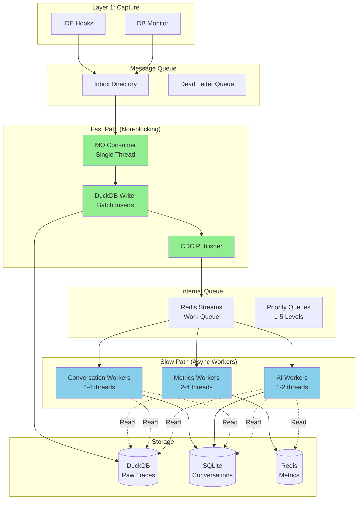

<!--
Copyright © 2025 Sierra Labs LLC
SPDX-License-Identifier: AGPL-3.0-only
License-Filename: LICENSE
-->

# Layer 2: Async Processing Pipeline Architecture

> Non-blocking Event Processing with Fast and Slow Paths
> Version: 1.0.0
> Date: November 2025

---

## Executive Summary

This document specifies the asynchronous, non-blocking processing pipeline for Layer 2 (Local Telemetry Server). The architecture ensures zero-latency raw trace ingestion while maintaining eventual consistency for derived metrics and conversation data.

## Problem Statement

The original synchronous pipeline created a critical bottleneck:
- Event processing required reads from multiple databases before writing
- This blocked the message queue consumer
- Under load, the message queue could overflow, losing events
- Latency increased linearly with enrichment complexity

## Solution: Fast/Slow Path Architecture

### Core Design Principles

1. **Write-First**: Raw events are written immediately with zero reads
2. **Async Enrichment**: Context lookups happen on separate threads
3. **Eventual Consistency**: Metrics update within seconds, not milliseconds
4. **Backpressure Management**: Graceful degradation under load
5. **Failure Isolation**: Problems in slow path don't affect fast path

### High-Level Architecture



## Fast Path Implementation

### Message Queue Consumer

```python
# server/fast_path/consumer.py (pseudocode)

class FastPathConsumer:
    """
    High-throughput consumer that writes raw events with zero blocking.
    Target: <1ms per event at P95.
    """

    batch_size = 100
    batch_timeout = 0.1  # 100ms

    async def run():
        """
        Main consumer loop - never blocks on I/O.

        While True:
        - Poll inbox for new messages (limit 1000, non-blocking)
        - For each message:
          - Read and parse JSON
          - Add _sequence (atomic increment) and _ingested_at
          - Append to batch
          - Delete message file immediately
          - Flush if batch_size reached
        - Time-based flush if batch_timeout exceeded
        - Sleep 1ms to prevent CPU spinning
        """

    async def flush_batch():
        """
        Write batch to DuckDB and publish CDC events.

        - writer.write_batch(batch)  # DuckDB insert, very fast
        - For each event: cdc.publish(...)  # Fire-and-forget
        - Clear batch
        - On error: Log but continue (DuckDB already durable)
        """

    def calculate_priority(event: Dict) -> int:
        """
        Assign priority for async processing.

        Priority levels (1=highest):
        1 - user_prompt, acceptance_decision
        2 - tool_use, completion
        3 - performance, latency
        4 - session_start, session_end
        5 - debug/trace events
        """
```

### Batch Writer for DuckDB

```python
# server/fast_path/duckdb_writer.py (pseudocode)

class DuckDBBatchWriter:
    """
    Optimized batch writer for DuckDB with zero reads.
    Uses prepared statements and columnar insert for speed.
    """

    async def write_batch(events: List[Dict]) -> None:
        """
        Write batch of events to DuckDB - no reads, no lookups, pure writes.

        - Prepare columnar data from events list
        - Single executemany() with INSERT statement
        - Auto-commit mode (no explicit commit needed)
        - Target: <2ms for 100 events at P95

        Schema: See database_architecture_detailed.md
        """
```

### CDC Publisher

```python
# server/fast_path/cdc_publisher.py (pseudocode)

class CDCPublisher:
    """
    Publishes change data capture events to Redis Streams.
    Fire-and-forget pattern for maximum throughput.
    """

    stream_key = 'cdc:events'
    max_stream_length = 100000

    async def publish(event: Dict) -> None:
        """
        Publish CDC event to Redis Stream (fire-and-forget).

        - Connect to Redis (lazy initialization)
        - XADD with MAXLEN=100000, approximate=True
        - Serialize event to JSON
        - Log warning on error but don't block
        - CDC failures don't affect fast path
        """
```

## Slow Path Implementation

### Worker Pool Manager

```python
# server/slow_path/worker_pool.py (pseudocode)

class WorkerPoolManager:
    """
    Manages pools of async workers for different processing types.
    Handles scaling, priority, and backpressure.
    """

    worker_config = {
        'metrics': {'count': 2, 'priority': [1, 2, 3]},
        'conversation': {'count': 2, 'priority': [1, 2]},
        'ai_insights': {'count': 1, 'priority': [4, 5]}
    }

    async def start() -> None:
        """
        Start all worker pools.

        - Create MetricsWorker instances (2x)
        - Create ConversationWorker instances (2x)
        - Create AIInsightsWorker instances (1x)
        - Start async task for each worker with _run_worker()
        - Start _monitor_backpressure() task
        """

    async def run_worker(worker, worker_type: str) -> None:
        """
        Run single worker with error handling.

        While running:
        - XREADGROUP from 'cdc:events' (block 1000ms)
        - Check event priority matches worker type
        - Call worker.process(event)
        - XACK on success
        - Track stats (processed, failed)
        - On error: Log and XACK (prevent reprocessing)
        """

    async def monitor_backpressure() -> None:
        """
        Monitor queue depth and adjust workers.

        Every 5 seconds:
        - Check stream length with XINFO STREAM
        - Calculate lag from oldest message timestamp
        - Log warnings if length > 10000
        - Log critical if length > 50000
        - Could scale workers or pause AI workers
        """
```

### Metrics Worker

```python
# server/slow_path/metrics_worker.py (pseudocode)

class MetricsWorker:
    """Calculates metrics from raw events. Can read from any store since it's async."""

    async def process(cdc_event: Dict) -> None:
        """
        Process single CDC event to calculate metrics.

        1. Read full event from duckdb.get_by_sequence(sequence)
        2. Get recent session stats from duckdb.get_session_stats(session_id, window=5min)
        3. Calculate metrics based on event_type:
           - 'tool_use': Calculate latency percentiles (p50, p95, p99)
           - 'acceptance_decision': Calculate acceptance rate (sliding window of 100)
           - 'session_start': Count active sessions in last 60 minutes
        4. Write all metrics to redis_metrics.record_metric()

        See layer2_metrics_derivation.md for detailed metric calculations
        """
```

### Conversation Worker

```python
# server/slow_path/conversation_worker.py (pseudocode)

class ConversationWorker:
    """
    Builds and updates conversation structure from events.
    Implements detailed reconstruction algorithms from layer2_conversation_reconstruction.md
    """

    async def process(cdc_event: Dict) -> None:
        """
        Process event to update conversation structure.

        1. Read full event from duckdb.get_by_sequence(sequence)
        2. Get or create conversation in SQLite
        3. Update based on event_type:
           - 'user_prompt': Add turn with content_hash
           - 'assistant_response': Add turn with tokens and latency
           - 'tool_use': Update tool_sequence and add turn
           - 'code_change': Add code change with acceptance tracking
        4. Update conversation metrics (acceptance rate, total changes)

        For platform-specific reconstruction:
        - See layer2_conversation_reconstruction.md#cursor-platform-reconstruction
        - See layer2_conversation_reconstruction.md#claude-code-platform-reconstruction
        """
```

## Performance Characteristics

### Latency Targets

| Component | Operation | Target P50 | Target P95 | Target P99 |
|-----------|----------|------------|------------|------------|
| **Fast Path** | | | | |
| MQ Read | Read message file | 0.1ms | 0.5ms | 1ms |
| Parse | JSON decode | 0.1ms | 0.2ms | 0.5ms |
| Batch Write | DuckDB insert (100 events) | 2ms | 5ms | 10ms |
| CDC Publish | Redis XADD | 0.5ms | 1ms | 2ms |
| **Total Fast Path** | End-to-end | **0.5ms** | **1ms** | **2ms** |
| | | | | |
| **Slow Path** | | | | |
| Metrics Calculation | Per event | 5ms | 20ms | 50ms |
| Conversation Update | Per event | 10ms | 50ms | 100ms |
| AI Insights | Per event | 100ms | 500ms | 1000ms |
| **Total Lag** | From ingest to metrics | **<1s** | **<5s** | **<10s** |

### Throughput Targets

| Metric | Target | Notes |
|--------|--------|-------|
| Fast path events/sec | 10,000 | Single consumer |
| DuckDB writes/sec | 100,000 | Batched inserts |
| CDC publishes/sec | 10,000 | Redis Streams |
| Metrics updates/sec | 1,000 | 2 workers |
| Conversation updates/sec | 500 | 2 workers |

## Backpressure Management

### Queue Depth Thresholds

```python
# server/config/backpressure.yaml

backpressure:
  thresholds:
    green:
      cdc_queue_depth: 1000
      actions: []

    yellow:
      cdc_queue_depth: 10000
      actions:
        - log_warning
        - add_metrics_worker
        - increase_batch_size

    orange:
      cdc_queue_depth: 50000
      actions:
        - log_error
        - pause_ai_workers
        - alert_user
        - add_all_workers

    red:
      cdc_queue_depth: 100000
      actions:
        - drop_low_priority
        - emergency_flush
        - page_on_call

  monitoring:
    check_interval_seconds: 5
    metrics_window_seconds: 60

  scaling:
    max_metrics_workers: 8
    max_conversation_workers: 4
    max_ai_workers: 2
    scale_up_threshold: 0.8  # 80% of threshold
    scale_down_threshold: 0.2  # 20% of threshold
```

### Graceful Degradation

1. **Priority Shedding**: Drop priority 5 events first, then 4, etc.
2. **Worker Reallocation**: Move AI workers to metrics processing
3. **Batch Size Increase**: Process more events per batch
4. **Timeout Reduction**: Reduce processing timeouts
5. **Circuit Breakers**: Disable non-critical enrichment

## Failure Recovery

### Component Failure Scenarios

#### Fast Path Failures

| Failure | Impact | Recovery |
|---------|--------|----------|
| MQ consumer crash | Events accumulate in inbox | Restart consumer, process backlog |
| DuckDB write failure | Events lost (critical!) | Write-ahead log, retry with exponential backoff |
| CDC publish failure | No metrics updates | Non-critical, log and continue |

#### Slow Path Failures

| Failure | Impact | Recovery |
|---------|--------|----------|
| Metrics worker crash | Metrics lag increases | Restart worker, process from last checkpoint |
| SQLite corruption | No conversation updates | Rebuild from DuckDB raw traces |
| Redis down | No real-time metrics | Cache locally, bulk update when recovered |

### Recovery Procedures

```python
# server/recovery/rebuilder.py (pseudocode)

class ConversationRebuilder:
    """Rebuilds conversation data from raw traces. Used for recovery after corruption or migration."""

    async def rebuild_session(session_id: str) -> None:
        """
        Rebuild single session from raw traces.

        - Get all events for session from DuckDB (ordered by timestamp)
        - Delete existing conversation data from SQLite
        - Replay events in order through ConversationWorker
        - Log completion
        """
```

## Monitoring and Observability

### Key Metrics

```python
# server/monitoring/metrics.py (pseudocode)

class PipelineMetrics:
    """Metrics exposed for monitoring."""

    def get_metrics() -> Dict:
        """
        Return pipeline health metrics.

        Categories:
        - fast_path: events/sec, batch_write_latency, cdc_publish_latency, queue_depth, dlq_depth
        - slow_path: cdc_queue_depth, processing_lag_ms, events_processed/failed, worker_utilization
        - storage: duckdb_size_mb, sqlite_size_mb, redis_memory_mb, parquet_archives_count
        - health: fast_path_healthy, slow_path_healthy, backpressure_level, data_consistency
        """
```

### Alerting Rules

```yaml
# server/monitoring/alerts.yaml

alerts:
  - name: FastPathDown
    condition: rate(events_ingested) == 0
    duration: 30s
    severity: critical
    action: page

  - name: HighCDCQueueDepth
    condition: cdc_queue_depth > 50000
    duration: 5m
    severity: warning
    action: email

  - name: ProcessingLagHigh
    condition: processing_lag_ms > 30000
    duration: 10m
    severity: warning
    action: slack

  - name: DuckDBWriteFailures
    condition: rate(duckdb_write_errors) > 0
    duration: 1m
    severity: critical
    action: page
```

## Conclusion

This async pipeline architecture achieves:

1. ✅ **Zero-blocking raw ingestion** (<1ms P95)
2. ✅ **Eventual consistency** for derived data (<5s typical)
3. ✅ **Graceful degradation** under load
4. ✅ **Failure isolation** between fast and slow paths
5. ✅ **Horizontal scalability** via worker pools

The architecture prioritizes data durability and raw event capture above all else, while providing rich analytics through eventually-consistent async processing.