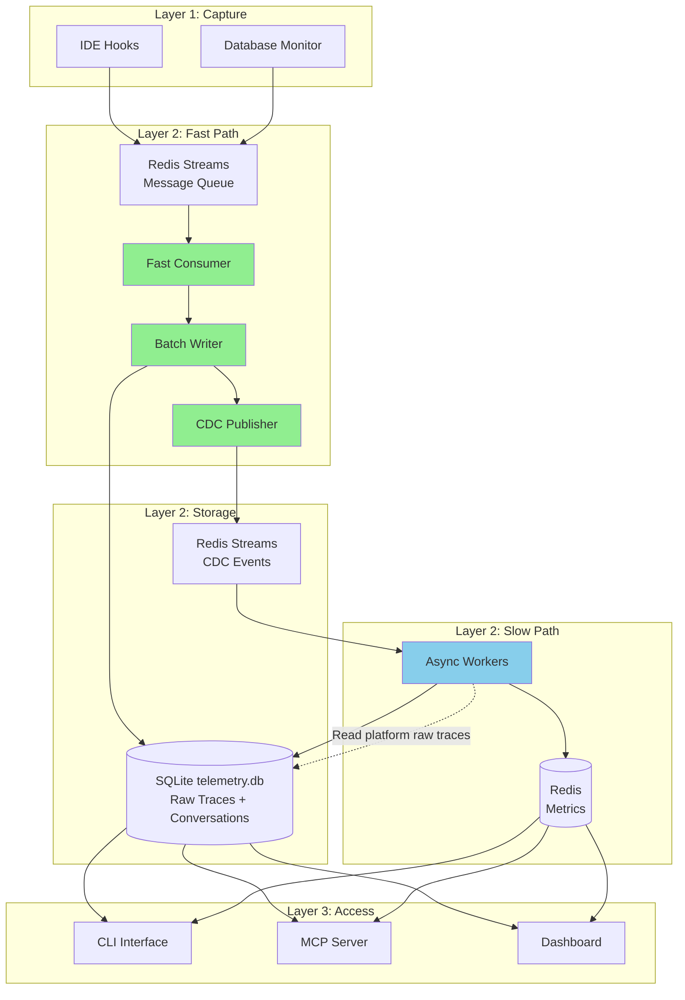

<!--
Copyright © 2025 Sierra Labs LLC
SPDX-License-Identifier: AGPL-3.0-only
License-Filename: LICENSE
-->

# Blueplane Local Database Architecture - Detailed Design

> Local-Only Database Architecture for Layers 1-3
> Version: 2.0.0
> Date: November 2025

---

## Executive Summary

This document specifies the database architecture for Blueplane's local implementation (Layers 1-3). Following the async pipeline pattern from `layer2_async_pipeline.md`, the architecture ensures sub-10ms raw trace ingestion while maintaining eventual consistency for derived metrics and conversation data. All databases run locally with no cloud dependencies. The system uses a simplified 2-database architecture: **SQLite** for all persistent data (raw traces and conversations in a single `telemetry.db` file) and **Redis** for real-time metrics and work queues. Layer 3 interfaces (CLI, MCP, Dashboard) access only processed data from SQLite (conversations) and Redis (metrics), never raw traces from the platform-specific raw traces tables (cursor_raw_traces and claude_raw_traces).

## Architecture Overview

### Core Design Principles

1. **Write-First**: Raw events written immediately with zero reads
2. **Async Enrichment**: Context lookups happen on separate threads
3. **Eventual Consistency**: Metrics update within seconds, not milliseconds
4. **Local-Only**: All data stays on the user's machine
5. **Privacy-First**: Sensitive data hashed, never transmitted

### Database Technology Stack

| Data Type | Database | Access Layer | Rationale |
|-----------|----------|--------------|-----------|
| **Raw Traces** | SQLite (`telemetry.db`) | Layer 2 Internal Only | Platform-specific tables (cursor_raw_traces, claude_raw_traces), zlib compression (7-10x), zero configuration, WAL mode for concurrency |
| **Conversations** | SQLite (`telemetry.db`) | Layer 2 & 3 | Same database as raw traces, ACID compliant, relational queries |
| **Real-Time Metrics** | Redis TimeSeries | Layer 2 & 3 | Sub-millisecond latency, built-in aggregations, automatic expiry |
| **Session Mappings** | SQLite (`telemetry.db`) | Layer 2 Only | Same database, lightweight key-value mappings |
| **Message Queue** | Redis Streams | Layer 1 & 2 | Atomic ingestion, at-least-once delivery, consumer groups |
| **Work Queue** | Redis Streams | Layer 2 Internal Only | CDC events for async workers, PEL-based retry |

## Data Flow Architecture



## Database Specifications

### 1. SQLite - Raw Trace Storage (Layer 2 Internal)

#### Database Configuration

```python
# storage/sqlite_config.py (pseudocode)

def initialize_database(db_path: str = '~/.blueplane/telemetry.db') -> None:
    """
    Initialize SQLite database with optimal settings.

    Configuration:
    - PRAGMA journal_mode=WAL              # Write-Ahead Logging for concurrency
    - PRAGMA synchronous=NORMAL            # Balance durability vs speed
    - PRAGMA cache_size=-64000             # 64MB cache
    - PRAGMA temp_store=MEMORY             # In-memory temp tables
    - PRAGMA mmap_size=268435456           # 256MB mmap for reads
    """
```

#### Schema Design

**Note**: The system uses platform-specific tables for raw traces:
- `cursor_raw_traces` - For Cursor IDE events
- `claude_raw_traces` - For Claude Code events

See [Cursor Raw Traces Capture](../../CURSOR_RAW_TRACES_CAPTURE.md) for the complete Cursor schema.
See [Claude Code JSONL Schema](../../CLAUDE_JSONL_SCHEMA.md) for the Claude Code schema.

**Example platform-specific schema (Cursor)**:

```sql
-- Cursor raw traces table with zlib compression
CREATE TABLE IF NOT EXISTS cursor_raw_traces (
    -- Core identification
    sequence INTEGER PRIMARY KEY AUTOINCREMENT,
    ingested_at TIMESTAMP DEFAULT CURRENT_TIMESTAMP,

    -- Event metadata (indexed fields)
    event_id TEXT NOT NULL,
    external_session_id TEXT,
    event_type TEXT NOT NULL,
    timestamp TIMESTAMP NOT NULL,

    -- Source location metadata
    storage_level TEXT NOT NULL,
    workspace_hash TEXT NOT NULL,
    database_table TEXT NOT NULL,
    item_key TEXT NOT NULL,

    -- Cursor-specific fields
    generation_uuid TEXT,
    composer_id TEXT,
    bubble_id TEXT,

    -- Context fields
    model TEXT,
    tool_name TEXT,

    -- Metrics (for fast filtering)
    duration_ms INTEGER,
    tokens_used INTEGER,
    lines_added INTEGER,
    lines_removed INTEGER,

    -- Compressed payload (zlib level 6, achieves 7-10x compression)
    event_data BLOB NOT NULL,

    -- Generated columns for partitioning
    event_date DATE GENERATED ALWAYS AS (DATE(timestamp)),
    event_hour INTEGER GENERATED ALWAYS AS (CAST(strftime('%H', timestamp) AS INTEGER))
);

-- Indexes for common query patterns
CREATE INDEX IF NOT EXISTS idx_cursor_session_time ON cursor_raw_traces(external_session_id, timestamp);
CREATE INDEX IF NOT EXISTS idx_cursor_event_type_time ON cursor_raw_traces(event_type, timestamp);
CREATE INDEX IF NOT EXISTS idx_cursor_date_hour ON cursor_raw_traces(event_date, event_hour);
CREATE INDEX IF NOT EXISTS idx_cursor_timestamp ON cursor_raw_traces(timestamp DESC);

-- Daily statistics table (pre-computed aggregations)
CREATE TABLE IF NOT EXISTS trace_stats (
    stat_date DATE PRIMARY KEY,
    total_events INTEGER NOT NULL,
    unique_sessions INTEGER NOT NULL,
    event_types TEXT NOT NULL,         -- JSON string
    platform_breakdown TEXT NOT NULL,  -- JSON string
    error_count INTEGER DEFAULT 0,
    avg_duration_ms REAL,
    total_tokens INTEGER DEFAULT 0,
    computed_at TIMESTAMP DEFAULT CURRENT_TIMESTAMP
);
```

#### Implementation

```python
# storage/sqlite_traces.py (pseudocode)

import zlib
import json

class SQLiteTraceStorage:
    """
    SQLite storage for raw traces with zlib compression.
    Implements fast path writer pattern with batch inserts.
    """

    db_path = '~/.blueplane/telemetry.db'
    compression_level = 6  # zlib level 6 achieves 7-10x compression

    def __init__():
        """
        Initialize database connection.

        - Open connection to db_path
        - Enable WAL mode and configure PRAGMAs
        - Create tables if not exist
        """

    def batch_insert(events: List[Dict]) -> None:
        """
        Fast path batch insert with compression.
        Target: <8ms for 100 events at P95.

        Steps:
        - For each event:
            - Extract indexed fields (event_id, session_id, event_type, etc.)
            - Compress full event data with zlib.compress(json.dumps(event), level=6)
            - Build row tuple
        - Execute single INSERT with executemany()
        - No explicit commit (WAL mode handles concurrency)
        """

    def get_by_sequence(sequence: int, platform: str) -> Dict:
        """
        Read single event by sequence (used by slow path workers).

        - SELECT event_data, indexed fields FROM {platform}_raw_traces WHERE sequence = ?
        - Decompress event_data with zlib.decompress()
        - Parse JSON and merge with indexed fields
        - Return complete event dict
        """

    def get_session_events(session_id: str, platform: str, start_time, end_time) -> List[Dict]:
        """
        Query events for conversation reconstruction.

        - SELECT FROM {platform}_raw_traces WHERE session_id = ? AND timestamp BETWEEN ? AND ?
        - ORDER BY timestamp ASC
        - Decompress and parse each event_data
        - Return list of event dicts
        """

    def calculate_session_metrics(session_id: str, platform: str) -> Dict:
        """
        Calculate aggregated metrics for session.

        - Query {platform}_raw_traces for session_id
        - Aggregate: SUM(tokens_used), COUNT(*), SUM(duration_ms), etc.
        - Return metrics dict (no decompression needed for aggregates)
        """

    def vacuum_old_traces(platform: str, days_to_keep: int = 90) -> None:
        """
        Delete old traces and reclaim space.

        - DELETE FROM {platform}_raw_traces WHERE event_date < (today - days_to_keep)
        - Execute VACUUM to reclaim disk space
        - Update trace_stats to remove old dates
        """
```

### 2. SQLite - Conversation Storage (Same Database)

**Note**: All conversation tables exist in the same `telemetry.db` database as raw traces. This single-file architecture simplifies deployment and backups.

#### Schema Design

**Important**: See [SESSION_CONVERSATION_SCHEMA.md](../../SESSION_CONVERSATION_SCHEMA.md) for the complete schema design rationale and migration strategy.

The schema handles platform differences:
- **Claude Code**: Sessions and conversations are 1:1 (no separate session concept)
- **Cursor**: Sessions represent IDE windows, which can contain multiple conversations

```sql
-- Cursor Sessions Table (Cursor only - Claude has no session concept)
CREATE TABLE IF NOT EXISTS cursor_sessions (
    id TEXT PRIMARY KEY,
    external_session_id TEXT NOT NULL UNIQUE,
    workspace_hash TEXT NOT NULL,
    workspace_name TEXT,
    workspace_path TEXT,
    started_at TIMESTAMP NOT NULL,
    ended_at TIMESTAMP,
    metadata TEXT DEFAULT '{}'
);

-- Conversations table (unified for both platforms)
CREATE TABLE IF NOT EXISTS conversations (
    id TEXT PRIMARY KEY,
    session_id TEXT,  -- NULL for Claude, references cursor_sessions.id for Cursor
    external_id TEXT NOT NULL,  -- Platform-specific external ID
    platform TEXT NOT NULL,
    workspace_hash TEXT,
    workspace_name TEXT,
    started_at TIMESTAMP NOT NULL,
    ended_at TIMESTAMP,

    -- JSON fields
    context TEXT DEFAULT '{}',
    metadata TEXT DEFAULT '{}',
    tool_sequence TEXT DEFAULT '[]',
    acceptance_decisions TEXT DEFAULT '[]',

    -- Metrics
    interaction_count INTEGER DEFAULT 0,
    acceptance_rate REAL,
    total_tokens INTEGER DEFAULT 0,
    total_changes INTEGER DEFAULT 0,

    -- Constraints
    FOREIGN KEY (session_id) REFERENCES cursor_sessions(id),
    CHECK (
        (platform = 'cursor' AND session_id IS NOT NULL) OR
        (platform = 'claude_code' AND session_id IS NULL)
    ),
    UNIQUE(external_id, platform)
);

-- Indexes
CREATE INDEX idx_conversations_session_cursor 
    ON conversations(session_id) WHERE platform = 'cursor';
CREATE INDEX idx_conversations_external 
    ON conversations(external_id, platform);
CREATE INDEX idx_conv_platform_time ON conversations(platform, started_at DESC);
```

#### Implementation

```python
# storage/sqlite_conversations.py (pseudocode)

class ConversationStorage:
    """
    SQLite storage for structured conversation data in telemetry.db.
    Uses same database connection as raw traces.
    Updated by slow path conversation workers.
    """

    db_path = '~/.blueplane/telemetry.db'  # Same database as raw traces

    def create_conversation(session_id, external_session_id, platform, workspace_hash) -> str:
        """
        Create new conversation (called by conversation worker).

        - Generate UUID for conversation ID
        - INSERT into conversations table
        - Return conversation ID
        """

    def add_turn(conversation_id, turn_type, content_hash, metadata, tokens_used, latency_ms, tools_called) -> str:
        """
        Add turn to conversation.

        - Get next turn number (MAX + 1)
        - INSERT into conversation_turns
        - Update conversation interaction_count
        - Return turn ID
        """

    def track_code_change(conversation_id, turn_id, file_extension, operation, lines_added, lines_removed, accepted, acceptance_delay_ms) -> str:
        """
        Track code change in conversation.

        - INSERT into code_changes
        - Update conversation acceptance metrics
        - Return change ID
        """

    def get_conversation_flow(conversation_id) -> Dict:
        """
        Get complete conversation with turns and changes.

        - Query conversation by ID
        - Query all turns ordered by turn_number
        - Query all code_changes ordered by timestamp
        - Return combined structure
        """

    def get_conversations_by_session(session_id) -> List[Dict]:
        """Get all conversations for a session (for Layer 3 access)."""

    def get_global_acceptance_metrics() -> Dict:
        """Get global acceptance rate metrics (for Layer 3 dashboards)."""

    def get_acceptance_statistics(time_range='7d') -> Dict:
        """Get acceptance statistics over time (for Layer 3 analytics)."""
```

### 3. Redis TimeSeries - Real-time Metrics

#### Configuration

**Metrics Configuration**:
```python
metrics_config = {
    'realtime': {  # 1-hour retention
        'active_sessions': {'retention': 3600000, 'type': 'gauge'},
        'events_per_second': {'retention': 3600000, 'type': 'counter'},
        'current_latency': {'retention': 3600000, 'type': 'gauge'},
    },
    'session': {  # 7-day retention
        'acceptance_rate': {'retention': 604800000, 'type': 'gauge'},
        'productivity_score': {'retention': 604800000, 'type': 'gauge'},
        'error_rate': {'retention': 604800000, 'type': 'gauge'},
        'tokens_per_minute': {'retention': 604800000, 'type': 'counter'},
    },
    'tools': {  # 1-day retention
        'tool_latency_p50': {'retention': 86400000, 'type': 'gauge'},
        'tool_latency_p95': {'retention': 86400000, 'type': 'gauge'},
        'tool_latency_p99': {'retention': 86400000, 'type': 'gauge'},
        'tool_success_rate': {'retention': 86400000, 'type': 'gauge'},
    }
}
```

**Aggregation Windows**:
- 1-minute: Retained for 1 hour
- 5-minute: Retained for 1 day
- 1-hour: Retained for 7 days

#### Implementation

```python
# storage/redis_metrics.py (pseudocode)

class RedisMetricsStorage:
    """Redis TimeSeries for real-time metrics."""

    def initialize_time_series() -> None:
        """
        Initialize time series with retention policies.

        - Create TS.CREATE for each metric with retention and labels
        - Create aggregation rules (1m, 5m, 1h)
        - Set duplicate policy to LAST
        """

    def record_metric(category, name, value, timestamp=None) -> None:
        """
        Record single metric value.

        - Build key: metric:{category}:{name}
        - Execute TS.ADD with timestamp and value
        """

    def get_metric_range(category, name, start_time, end_time, aggregation=None) -> List[Tuple]:
        """
        Get metric values for time range.

        - Use aggregated key if aggregation specified
        - Execute TS.RANGE with time bounds
        - Return list of (timestamp, value) tuples
        """

    def get_latest_metrics(category=None) -> Dict:
        """
        Get latest values for dashboard display.

        - Pattern match metric keys
        - Execute TS.GET for each key
        - Return dict of metric_name -> latest_value
        """
```

### 4. Redis Streams - CDC Work Queue (Layer 2 Internal)

#### Implementation

```python
# storage/redis_cdc.py (pseudocode)

class CDCWorkQueue:
    """
    Redis Streams for CDC event distribution.
    Connects fast path to slow path workers.
    """

    stream_key = 'cdc:events'
    consumer_group = 'workers'
    max_stream_length = 100000

    async def initialize() -> None:
        """
        Setup Redis connection and consumer group.

        - Connect to Redis
        - Create consumer group with XGROUP CREATE
        - Set stream position to '0' (start from beginning)
        """

    async def publish(event: Dict) -> None:
        """
        Publish CDC event from fast path (fire-and-forget).

        - Serialize event to JSON
        - Execute XADD with MAXLEN approximate trim
        - Silently fail on error (don't block fast path)
        """

    async def consume(consumer_name: str, count: int = 1) -> AsyncGenerator[Dict]:
        """
        Consume events for slow path workers.

        - Execute XREADGROUP with block timeout
        - Yield (message_id, event) pairs
        - Blocks until events available
        """

    async def acknowledge(message_id: str) -> None:
        """Mark message as processed with XACK."""

    async def get_queue_stats() -> Dict:
        """
        Monitor queue depth and lag.

        - Execute XINFO STREAM for stream stats
        - Execute XPENDING for pending message count
        - Calculate lag from oldest message timestamp
        - Return stats dict
        """
```

## Integration with Async Pipeline

### Fast Path Integration

```python
# Platform-specific event consumers (claude_code/event_consumer.py, cursor/event_consumer.py)
# Pseudocode showing the integration pattern:

class FastPathIntegration:
    """Integrates databases with fast path consumer. Zero reads, pure writes."""

    batch_size = 100

    async def process_message(message: Dict) -> None:
        """
        Process single message from Layer 1.

        - Increment sequence counter
        - Add _sequence and _ingested_at to message
        - Append to batch
        - Flush if batch size reached
        """

    async def flush_batch() -> None:
        """
        Write batch to SQLite and publish CDC events.

        - Call sqlite.batch_insert(batch)  # Synchronous write with zlib compression
        - For each event: cdc_queue.publish(...)  # Async, fire-and-forget
        - Clear batch
        - Target: <10ms for 100 events including compression
        """

    def calculate_priority(event: Dict) -> int:
        """
        Assign priority for async processing.

        Priority levels:
        1 - user_prompt, acceptance_decision
        2 - tool_use, completion
        3 - performance
        4 - session_start, session_end
        5 - default
        """
```

### Slow Path Integration

```python
# slow_path/integration.py (pseudocode)

class SlowPathWorker:
    """Base class for slow path workers. Reads from all databases as needed."""

    async def run() -> None:
        """
        Main worker loop.

        - Consume messages from CDC queue
        - Process each event
        - Acknowledge message on success
        - Log errors but continue processing
        """

    async def process_event(event: Dict) -> None:
        """Override in subclasses."""


class MetricsWorker(SlowPathWorker):
    """Calculate metrics from events."""

    async def process_event(event: Dict) -> None:
        """
        Process event to calculate metrics.

        - Read full_event from sqlite.get_by_sequence(sequence, platform)
        - Decompress event_data to get complete payload
        - Switch on event_type:
            - 'tool_use': Record latency to redis_metrics
            - 'acceptance_decision': Calculate and record acceptance rate
            - 'session_start': Record active sessions count
        """


class ConversationWorker(SlowPathWorker):
    """Build conversation structure."""

    async def process_event(event: Dict) -> None:
        """
        Update conversation from event.

        - Read full_event from sqlite.get_by_sequence(sequence, platform)
        - Decompress event_data to get complete payload
        - Get or create conversation in SQLite conversations table
        - Switch on event_type:
            - 'user_prompt': Add turn to conversation_turns
            - 'assistant_response': Add turn with tokens
            - 'tool_use': Update tool_sequence
            - 'code_change': Track change in code_changes table and update metrics
        """
```

## Layer 3 Access Patterns

### CLI Interface Access

```python
# cli/database_access.py (pseudocode)

class CLIDatabaseAccess:
    """Database access for CLI commands - processed data only (SQLite + Redis)."""

    def get_session_summary(session_id: str) -> Dict:
        """
        Get processed session data for CLI display.

        - Query sqlite.get_conversations_by_session(session_id)
        - Query redis.get_latest_metrics('session')
        - Query redis.get_latest_metrics('realtime')
        - Return combined dict
        """

    def get_dashboard_data() -> Dict:
        """
        Get aggregated metrics for dashboard display.

        - Query redis for realtime, tools, session metrics
        - Query sqlite for acceptance rates
        - Return combined dashboard data
        """
```

### MCP Server Access

```python
# mcp/database_access.py (pseudocode)

class MCPDatabaseAccess:
    """Database access for MCP server - enriched data only (SQLite + Redis)."""

    async def handle_query(query_type: str, params: Dict) -> Any:
        """
        Handle MCP queries for processed data.

        Supported query types:
        - 'get_conversation': sqlite.get_conversation_flow()
        - 'get_session_conversations': sqlite.get_conversations_by_session()
        - 'get_metrics': redis.get_metric_range()
        - 'get_acceptance_stats': sqlite.get_acceptance_statistics()
        """
```

## Performance Characteristics

### Write Performance

| Operation | Target P50 | Target P95 | Target P99 |
|-----------|------------|------------|------------|
| SQLite batch insert (100 events, zlib compressed) | 5ms | 10ms | 20ms |
| Redis Stream publish (XADD) | 0.2ms | 0.5ms | 1ms |
| SQLite conversation update | 2ms | 5ms | 10ms |
| Redis metric write (TS.ADD) | 0.1ms | 0.2ms | 0.5ms |

**Note**: SQLite batch writes include zlib compression overhead (~3-5ms for 100 events). WAL mode allows concurrent reads during writes.

### Read Performance

| Operation | Target P50 | Target P95 | Target P99 |
|-----------|------------|------------|------------|
| SQLite sequence lookup (with decompress) | 1ms | 3ms | 8ms |
| SQLite session query (decompress multiple) | 10ms | 40ms | 100ms |
| SQLite conversation fetch (no decompress) | 2ms | 10ms | 20ms |
| Redis metric range query | 1ms | 5ms | 10ms |

**Note**: Read operations on platform-specific raw traces tables (cursor_raw_traces, claude_raw_traces) include zlib decompression overhead. Conversation queries access uncompressed structured data.

### Storage Requirements

| Database | Initial Size | Growth Rate (7-10x compression) | Retention |
|----------|-------------|-------------|-----------|
| SQLite `telemetry.db` | 5MB | ~14MB/day (raw traces), ~10MB/month (conversations) | 90 days default, configurable |
| Redis | 50MB | Stable (automatic expiry) | 1 hour to 7 days depending on metric type |

**Compression Efficiency**:
- **Uncompressed event**: ~1.4KB average
- **zlib level 6 compressed**: ~200 bytes (7x compression)
- **Daily volume estimate**: 10,000 events/day = 2MB compressed vs 14MB uncompressed

## Monitoring and Maintenance

### Health Checks

```python
# monitoring/health.py (pseudocode)

class DatabaseHealthMonitor:
    """Monitor database health."""

    async def check_all() -> Dict:
        """
        Run all health checks.

        Returns dict with health status for:
        - sqlite:
            - file_size_mb (telemetry.db)
            - cursor_raw_trace_count, claude_raw_trace_count, conversation_count
            - oldest_trace_date, newest_trace_date
            - wal_size_mb, integrity_check
        - redis:
            - memory_mb
            - stream_queue_depth (telemetry:message_queue, cdc:events)
            - lag_ms (oldest unprocessed message)
            - timeseries_count
        """
```

### Maintenance Tasks

```python
# maintenance/tasks.py (pseudocode)

class MaintenanceTasks:
    """Scheduled maintenance tasks."""

    async def daily_maintenance() -> None:
        """
        Run daily maintenance.

        - Delete old raw traces from SQLite platform tables (days_to_keep=90)
        - Checkpoint WAL: PRAGMA wal_checkpoint(TRUNCATE)
        - XTRIM Redis streams (maxlen=100000)
        - Update trace_stats table with daily aggregations
        """

    async def weekly_maintenance() -> None:
        """
        Run weekly maintenance.

        - VACUUM SQLite (reclaim space after deletions)
        - ANALYZE SQLite tables (update query planner statistics)
        - REINDEX SQLite if needed
        - BGREWRITEAOF Redis (compact AOF file)
        """
```

## Conclusion

This simplified 2-database local architecture provides:

1. **Sub-10ms ingestion** - Fast path batch writes with zlib compression
2. **Eventual consistency** - Async enrichment without blocking
3. **Privacy-first** - All data stays local, raw traces isolated in Layer 2
4. **Clean separation** - Layer 3 accesses only processed data (conversations and metrics)
5. **Efficient storage** - 7-10x zlib compression for raw traces, relational structure for conversations
6. **Real-time metrics** - Sub-millisecond dashboard updates via Redis TimeSeries
7. **Simple deployment** - Single SQLite file + Redis, no cloud dependencies
8. **Zero configuration** - Embedded databases with automatic setup

**Key Architecture Benefits**:
- **Single Database File**: `telemetry.db` contains both raw traces (platform-specific tables) and conversations
- **Platform-Specific Storage**: Separate tables (cursor_raw_traces, claude_raw_traces) optimize for platform-specific data structures
- **At-Least-Once Delivery**: Redis Streams PEL ensures no message loss
- **Concurrent Access**: SQLite WAL mode allows simultaneous reads and writes
- **Automatic Compression**: zlib level 6 achieves 7-10x space savings transparently
- **Simple Backups**: Copy `telemetry.db` file for complete backup

The architecture follows the async pipeline pattern with a simplified technology stack (Redis Streams + SQLite only), ensuring high performance while maintaining data quality and enabling rich analytics capabilities. Raw event data in the platform-specific raw traces tables (cursor_raw_traces and claude_raw_traces) remains internal to Layer 2, with Layer 3 interfaces consuming only enriched, processed data from SQLite conversations and Redis metrics.