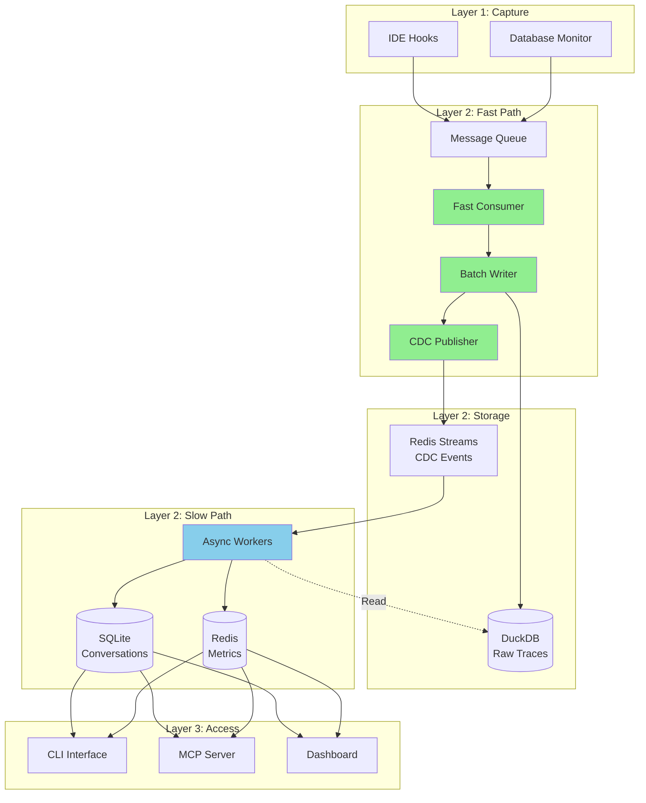

<!--
Copyright © 2025 Sierra Labs LLC
SPDX-License-Identifier: AGPL-3.0-only
License-Filename: LICENSE
-->

# Blueplane Local Database Architecture - Detailed Design

> Local-Only Database Architecture for Layers 1-3
> Version: 2.0.0
> Date: November 2025

---

## Executive Summary

This document specifies the database architecture for Blueplane's local implementation (Layers 1-3). Following the async pipeline pattern from `layer2_async_pipeline.md`, the architecture ensures zero-latency raw trace ingestion while maintaining eventual consistency for derived metrics and conversation data. All databases run locally with no cloud dependencies. Layer 3 interfaces (CLI, MCP, Dashboard) access only processed data from SQLite (conversations) and Redis (metrics), never raw traces from DuckDB.

## Architecture Overview

### Core Design Principles

1. **Write-First**: Raw events written immediately with zero reads
2. **Async Enrichment**: Context lookups happen on separate threads
3. **Eventual Consistency**: Metrics update within seconds, not milliseconds
4. **Local-Only**: All data stays on the user's machine
5. **Privacy-First**: Sensitive data hashed, never transmitted

### Database Technology Stack

| Data Type | Database | Access Layer | Rationale |
|-----------|----------|--------------|-----------|
| **Raw Traces** | DuckDB | Layer 2 Internal Only | In-process OLAP, columnar storage, SQL analytics |
| **Conversations** | SQLite | Layer 2 & 3 | Embedded, ACID compliant, zero configuration |
| **Real-Time Metrics** | Redis TimeSeries | Layer 2 & 3 | Sub-millisecond latency, built-in aggregations |
| **Session Mappings** | SQLite | Layer 2 Only | Lightweight key-value mappings |
| **Work Queue** | Redis Streams | Layer 2 Internal Only | CDC events, priority queuing |

## Data Flow Architecture



## Database Specifications

### 1. DuckDB - Raw Trace Storage (Layer 2 Internal)

#### Schema Design

```sql
-- Main raw traces table
CREATE TABLE IF NOT EXISTS raw_traces (
    -- Core identification
    sequence BIGINT PRIMARY KEY,
    ingested_at TIMESTAMP NOT NULL,

    -- Event metadata
    timestamp TIMESTAMP NOT NULL,
    event_id VARCHAR DEFAULT (gen_random_uuid()),
    session_id VARCHAR NOT NULL,
    event_type VARCHAR NOT NULL,
    platform VARCHAR NOT NULL,

    -- Context
    workspace_hash VARCHAR,
    model VARCHAR,
    tool_name VARCHAR,

    -- Metrics
    duration_ms INTEGER,
    tokens_used INTEGER,
    lines_added INTEGER,
    lines_removed INTEGER,
    error_code VARCHAR,

    -- Payload (compressed JSON)
    payload JSON,
    metadata JSON,

    -- Computed columns for partitioning
    event_date DATE GENERATED ALWAYS AS (DATE_TRUNC('day', timestamp)) STORED,
    event_hour INTEGER GENERATED ALWAYS AS (HOUR(timestamp)) STORED
);

-- Indexes for common queries
CREATE INDEX idx_session_time ON raw_traces(session_id, timestamp);
CREATE INDEX idx_event_type_time ON raw_traces(event_type, timestamp);
CREATE INDEX idx_date_hour ON raw_traces(event_date, event_hour);

-- Daily statistics table (for fast aggregations)
CREATE TABLE IF NOT EXISTS trace_stats (
    stat_date DATE PRIMARY KEY,
    total_events BIGINT,
    unique_sessions INTEGER,
    event_types JSON,
    platform_breakdown JSON,
    error_count INTEGER,
    avg_duration_ms DOUBLE,
    total_tokens BIGINT
);
```

#### Implementation

```python
# storage/duckdb_traces.py (pseudocode)

class DuckDBTraceStorage:
    """
    DuckDB storage for raw traces with zero-read fast path.
    Implements the fast path writer pattern from layer2_async_pipeline.md.
    """

    def batch_insert(events: List[Dict]) -> None:
        """
        Fast path batch insert - no reads, just writes.
        Target: <2ms for 100 events at P95.

        - Prepare columnar data from events
        - Single batch INSERT with prepared statement
        - No commit needed (auto-commit mode)
        """

    def get_by_sequence(sequence: int) -> Dict:
        """Used by slow path workers to read full event."""

    def get_session_events(session_id: str, start_time, end_time) -> List[Dict]:
        """Query events for conversation reconstruction."""

    def calculate_session_metrics(session_id: str) -> Dict:
        """Calculate aggregated metrics for metrics workers."""

    def archive_old_traces(days_to_keep: int = 7) -> None:
        """
        Archive old traces to Parquet files.

        - Export to Parquet with ZSTD compression
        - Delete archived data from main table
        - Update daily statistics
        """
```

### 2. SQLite - Conversation Storage

#### Schema Design

```sql
-- Conversations table
CREATE TABLE IF NOT EXISTS conversations (
    id TEXT PRIMARY KEY,
    session_id TEXT NOT NULL,
    external_session_id TEXT NOT NULL,
    platform TEXT NOT NULL,
    workspace_hash TEXT,
    started_at TIMESTAMP NOT NULL,
    ended_at TIMESTAMP,

    -- JSON fields
    context TEXT DEFAULT '{}',
    metadata TEXT DEFAULT '{}',
    tool_sequence TEXT DEFAULT '[]',
    acceptance_decisions TEXT DEFAULT '[]',

    -- Metrics
    interaction_count INTEGER DEFAULT 0,
    acceptance_rate REAL,
    total_tokens INTEGER DEFAULT 0,
    total_changes INTEGER DEFAULT 0,

    UNIQUE(external_session_id, platform)
);

CREATE INDEX idx_conv_session ON conversations(session_id);
CREATE INDEX idx_conv_platform_time ON conversations(platform, started_at DESC);

-- Conversation turns table
CREATE TABLE IF NOT EXISTS conversation_turns (
    id TEXT PRIMARY KEY,
    conversation_id TEXT NOT NULL REFERENCES conversations(id),
    turn_number INTEGER NOT NULL,
    timestamp TIMESTAMP NOT NULL,
    turn_type TEXT CHECK (turn_type IN ('user_prompt', 'assistant_response', 'tool_use')),

    content_hash TEXT,
    metadata TEXT DEFAULT '{}',
    tokens_used INTEGER,
    latency_ms INTEGER,
    tools_called TEXT,

    UNIQUE(conversation_id, turn_number)
);

CREATE INDEX idx_turn_conv ON conversation_turns(conversation_id, turn_number);

-- Code changes table
CREATE TABLE IF NOT EXISTS code_changes (
    id TEXT PRIMARY KEY,
    conversation_id TEXT NOT NULL REFERENCES conversations(id),
    turn_id TEXT REFERENCES conversation_turns(id),
    timestamp TIMESTAMP NOT NULL,

    file_extension TEXT,
    operation TEXT CHECK (operation IN ('create', 'edit', 'delete', 'read')),
    lines_added INTEGER DEFAULT 0,
    lines_removed INTEGER DEFAULT 0,

    accepted BOOLEAN,
    acceptance_delay_ms INTEGER,
    revision_count INTEGER DEFAULT 0
);

CREATE INDEX idx_changes_conv ON code_changes(conversation_id);
CREATE INDEX idx_changes_accepted ON code_changes(accepted, timestamp);

-- Session mappings table
CREATE TABLE IF NOT EXISTS session_mappings (
    external_id TEXT PRIMARY KEY,
    internal_id TEXT NOT NULL,
    platform TEXT NOT NULL,
    created_at TIMESTAMP DEFAULT CURRENT_TIMESTAMP,

    UNIQUE(external_id, platform)
);
```

#### Implementation

```python
# storage/sqlite_conversations.py (pseudocode)

class ConversationStorage:
    """
    SQLite storage for structured conversation data.
    Updated by slow path conversation workers.
    """

    def create_conversation(session_id, external_session_id, platform, workspace_hash) -> str:
        """
        Create new conversation (called by conversation worker).

        - Generate UUID for conversation ID
        - INSERT into conversations table
        - Return conversation ID
        """

    def add_turn(conversation_id, turn_type, content_hash, metadata, tokens_used, latency_ms, tools_called) -> str:
        """
        Add turn to conversation.

        - Get next turn number (MAX + 1)
        - INSERT into conversation_turns
        - Update conversation interaction_count
        - Return turn ID
        """

    def track_code_change(conversation_id, turn_id, file_extension, operation, lines_added, lines_removed, accepted, acceptance_delay_ms) -> str:
        """
        Track code change in conversation.

        - INSERT into code_changes
        - Update conversation acceptance metrics
        - Return change ID
        """

    def get_conversation_flow(conversation_id) -> Dict:
        """
        Get complete conversation with turns and changes.

        - Query conversation by ID
        - Query all turns ordered by turn_number
        - Query all code_changes ordered by timestamp
        - Return combined structure
        """

    def get_conversations_by_session(session_id) -> List[Dict]:
        """Get all conversations for a session (for Layer 3 access)."""

    def get_global_acceptance_metrics() -> Dict:
        """Get global acceptance rate metrics (for Layer 3 dashboards)."""

    def get_acceptance_statistics(time_range='7d') -> Dict:
        """Get acceptance statistics over time (for Layer 3 analytics)."""
```

### 3. Redis TimeSeries - Real-time Metrics

#### Configuration

**Metrics Configuration**:
```python
metrics_config = {
    'realtime': {  # 1-hour retention
        'active_sessions': {'retention': 3600000, 'type': 'gauge'},
        'events_per_second': {'retention': 3600000, 'type': 'counter'},
        'current_latency': {'retention': 3600000, 'type': 'gauge'},
    },
    'session': {  # 7-day retention
        'acceptance_rate': {'retention': 604800000, 'type': 'gauge'},
        'productivity_score': {'retention': 604800000, 'type': 'gauge'},
        'error_rate': {'retention': 604800000, 'type': 'gauge'},
        'tokens_per_minute': {'retention': 604800000, 'type': 'counter'},
    },
    'tools': {  # 1-day retention
        'tool_latency_p50': {'retention': 86400000, 'type': 'gauge'},
        'tool_latency_p95': {'retention': 86400000, 'type': 'gauge'},
        'tool_latency_p99': {'retention': 86400000, 'type': 'gauge'},
        'tool_success_rate': {'retention': 86400000, 'type': 'gauge'},
    }
}
```

**Aggregation Windows**:
- 1-minute: Retained for 1 hour
- 5-minute: Retained for 1 day
- 1-hour: Retained for 7 days

#### Implementation

```python
# storage/redis_metrics.py (pseudocode)

class RedisMetricsStorage:
    """Redis TimeSeries for real-time metrics."""

    def initialize_time_series() -> None:
        """
        Initialize time series with retention policies.

        - Create TS.CREATE for each metric with retention and labels
        - Create aggregation rules (1m, 5m, 1h)
        - Set duplicate policy to LAST
        """

    def record_metric(category, name, value, timestamp=None) -> None:
        """
        Record single metric value.

        - Build key: metric:{category}:{name}
        - Execute TS.ADD with timestamp and value
        """

    def get_metric_range(category, name, start_time, end_time, aggregation=None) -> List[Tuple]:
        """
        Get metric values for time range.

        - Use aggregated key if aggregation specified
        - Execute TS.RANGE with time bounds
        - Return list of (timestamp, value) tuples
        """

    def get_latest_metrics(category=None) -> Dict:
        """
        Get latest values for dashboard display.

        - Pattern match metric keys
        - Execute TS.GET for each key
        - Return dict of metric_name -> latest_value
        """
```

### 4. Redis Streams - CDC Work Queue (Layer 2 Internal)

#### Implementation

```python
# storage/redis_cdc.py (pseudocode)

class CDCWorkQueue:
    """
    Redis Streams for CDC event distribution.
    Connects fast path to slow path workers.
    """

    stream_key = 'cdc:events'
    consumer_group = 'workers'
    max_stream_length = 100000

    async def initialize() -> None:
        """
        Setup Redis connection and consumer group.

        - Connect to Redis
        - Create consumer group with XGROUP CREATE
        - Set stream position to '0' (start from beginning)
        """

    async def publish(event: Dict) -> None:
        """
        Publish CDC event from fast path (fire-and-forget).

        - Serialize event to JSON
        - Execute XADD with MAXLEN approximate trim
        - Silently fail on error (don't block fast path)
        """

    async def consume(consumer_name: str, count: int = 1) -> AsyncGenerator[Dict]:
        """
        Consume events for slow path workers.

        - Execute XREADGROUP with block timeout
        - Yield (message_id, event) pairs
        - Blocks until events available
        """

    async def acknowledge(message_id: str) -> None:
        """Mark message as processed with XACK."""

    async def get_queue_stats() -> Dict:
        """
        Monitor queue depth and lag.

        - Execute XINFO STREAM for stream stats
        - Execute XPENDING for pending message count
        - Calculate lag from oldest message timestamp
        - Return stats dict
        """
```

## Integration with Async Pipeline

### Fast Path Integration

```python
# fast_path/integration.py (pseudocode)

class FastPathIntegration:
    """Integrates databases with fast path consumer. Zero reads, pure writes."""

    batch_size = 100

    async def process_message(message: Dict) -> None:
        """
        Process single message from Layer 1.

        - Increment sequence counter
        - Add _sequence and _ingested_at to message
        - Append to batch
        - Flush if batch size reached
        """

    async def flush_batch() -> None:
        """
        Write batch to DuckDB and publish CDC events.

        - Call duckdb.batch_insert(batch)  # Synchronous, very fast
        - For each event: cdc_queue.publish(...)  # Async, fire-and-forget
        - Clear batch
        """

    def calculate_priority(event: Dict) -> int:
        """
        Assign priority for async processing.

        Priority levels:
        1 - user_prompt, acceptance_decision
        2 - tool_use, completion
        3 - performance
        4 - session_start, session_end
        5 - default
        """
```

### Slow Path Integration

```python
# slow_path/integration.py (pseudocode)

class SlowPathWorker:
    """Base class for slow path workers. Reads from all databases as needed."""

    async def run() -> None:
        """
        Main worker loop.

        - Consume messages from CDC queue
        - Process each event
        - Acknowledge message on success
        - Log errors but continue processing
        """

    async def process_event(event: Dict) -> None:
        """Override in subclasses."""


class MetricsWorker(SlowPathWorker):
    """Calculate metrics from events."""

    async def process_event(event: Dict) -> None:
        """
        Process event to calculate metrics.

        - Read full_event from duckdb.get_by_sequence(sequence)
        - Switch on event_type:
            - 'tool_use': Record latency to redis_metrics
            - 'acceptance_decision': Calculate and record acceptance rate
            - 'session_start': Record active sessions count
        """


class ConversationWorker(SlowPathWorker):
    """Build conversation structure."""

    async def process_event(event: Dict) -> None:
        """
        Update conversation from event.

        - Read full_event from DuckDB
        - Get or create conversation in SQLite
        - Switch on event_type:
            - 'user_prompt': Add turn
            - 'assistant_response': Add turn with tokens
            - 'tool_use': Update tool_sequence
            - 'code_change': Track change and update metrics
        """
```

## Layer 3 Access Patterns

### CLI Interface Access

```python
# cli/database_access.py (pseudocode)

class CLIDatabaseAccess:
    """Database access for CLI commands - processed data only (SQLite + Redis)."""

    def get_session_summary(session_id: str) -> Dict:
        """
        Get processed session data for CLI display.

        - Query sqlite.get_conversations_by_session(session_id)
        - Query redis.get_latest_metrics('session')
        - Query redis.get_latest_metrics('realtime')
        - Return combined dict
        """

    def get_dashboard_data() -> Dict:
        """
        Get aggregated metrics for dashboard display.

        - Query redis for realtime, tools, session metrics
        - Query sqlite for acceptance rates
        - Return combined dashboard data
        """
```

### MCP Server Access

```python
# mcp/database_access.py (pseudocode)

class MCPDatabaseAccess:
    """Database access for MCP server - enriched data only (SQLite + Redis)."""

    async def handle_query(query_type: str, params: Dict) -> Any:
        """
        Handle MCP queries for processed data.

        Supported query types:
        - 'get_conversation': sqlite.get_conversation_flow()
        - 'get_session_conversations': sqlite.get_conversations_by_session()
        - 'get_metrics': redis.get_metric_range()
        - 'get_acceptance_stats': sqlite.get_acceptance_statistics()
        """
```

## Performance Characteristics

### Write Performance

| Operation | Target P50 | Target P95 | Target P99 |
|-----------|------------|------------|------------|
| DuckDB batch insert (100 events) | 1ms | 2ms | 5ms |
| Redis Stream publish | 0.2ms | 0.5ms | 1ms |
| SQLite conversation update | 2ms | 5ms | 10ms |
| Redis metric write | 0.1ms | 0.2ms | 0.5ms |

### Read Performance

| Operation | Target P50 | Target P95 | Target P99 |
|-----------|------------|------------|------------|
| DuckDB sequence lookup | 0.5ms | 1ms | 2ms |
| DuckDB session query | 5ms | 20ms | 50ms |
| SQLite conversation fetch | 2ms | 10ms | 20ms |
| Redis metric range query | 1ms | 5ms | 10ms |

### Storage Requirements

| Database | Initial Size | Growth Rate | Retention |
|----------|-------------|-------------|-----------|
| DuckDB | 10MB | ~100MB/day | 7 days active, archive to Parquet |
| SQLite | 1MB | ~10MB/month | Unlimited |
| Redis | 50MB | Stable | Time-based expiry |

## Monitoring and Maintenance

### Health Checks

```python
# monitoring/health.py (pseudocode)

class DatabaseHealthMonitor:
    """Monitor database health."""

    async def check_all() -> Dict:
        """
        Run all health checks.

        Returns dict with health status for:
        - duckdb: size_mb, event_count, oldest_event
        - sqlite: size_mb, conversation_count, integrity
        - redis: memory_mb, queue_depth, lag_ms
        """
```

### Maintenance Tasks

```python
# maintenance/tasks.py (pseudocode)

class MaintenanceTasks:
    """Scheduled maintenance tasks."""

    async def daily_maintenance() -> None:
        """
        Run daily maintenance.

        - Archive old DuckDB traces (days_to_keep=7)
        - VACUUM SQLite
        - XTRIM Redis streams (maxlen=100000)
        """

    async def weekly_maintenance() -> None:
        """
        Run weekly maintenance.

        - ANALYZE DuckDB tables
        - REINDEX SQLite
        - BGREWRITEAOF Redis
        """
```

## Conclusion

This local database architecture provides:

1. **Zero-blocking ingestion** - Fast path writes with no reads
2. **Eventual consistency** - Async enrichment without blocking
3. **Privacy-first** - All data stays local, raw traces isolated in Layer 2
4. **Clean separation** - Layer 3 accesses only processed data (SQLite/Redis)
5. **Efficient storage** - Columnar for analytics, relational for structure
6. **Real-time metrics** - Sub-millisecond dashboard updates
7. **Simple deployment** - All databases run locally, no cloud dependencies

The architecture follows the async pipeline pattern, ensuring high performance while maintaining data quality and enabling rich analytics capabilities. Raw event data in DuckDB remains internal to Layer 2, with Layer 3 interfaces consuming only enriched, processed data from SQLite and Redis.