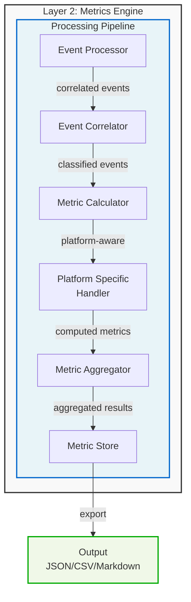
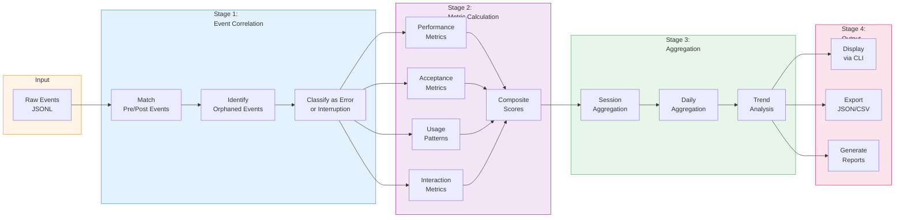

<!--
Copyright © 2025 Sierra Labs LLC
SPDX-License-Identifier: AGPL-3.0-only
License-Filename: LICENSE
-->

# Layer 2: Metrics Derivation and Analytics Pipeline

## Overview

Layer 2 processes raw telemetry events captured by Layer 1 to derive actionable metrics about AI-assisted coding sessions. This document defines all metrics that can be derived from captured data, building on the telemetry testbed CLI foundation.

## Architecture



## Metric Categories

### 1. Core Performance Metrics

#### 1.1 Latency Metrics

**Description**: Timing measurements for all operations

| Metric                     | Calculation                       | Platform | Unit    |
| -------------------------- | --------------------------------- | -------- | ------- |
| Tool Execution Latency     | `post_time - pre_time`            | All      | ms      |
| Response Time              | `first_tool_time - prompt_time`   | All      | ms      |
| Session Duration           | `stop_time - start_time`          | All      | seconds |
| Command Processing Time    | `execution_end - execution_start` | All      | ms      |
| Streaming Response Latency | Time to first chunk               | All      | ms      |
| Complete Response Time     | Time to last chunk                | All      | ms      |

**Aggregations**:

- Average, min, max, p50, p95, p99 per tool type
- Distribution by time of day
- Trend analysis over time

#### 1.2 Throughput Metrics

**Description**: Volume and rate measurements

| Metric              | Calculation                         | Platform | Unit      |
| ------------------- | ----------------------------------- | -------- | --------- |
| Events Per Second   | `event_count / session_duration`    | All      | events/s  |
| Tools Per Minute    | `tool_count / (duration / 60)`      | All      | tools/min |
| Lines Per Hour      | `lines_changed / (duration / 3600)` | All      | lines/hr  |
| Files Per Session   | `unique_files / session_count`      | All      | files     |
| Prompts Per Session | `prompt_count / session_count`      | All      | prompts   |

### 2. Acceptance and Quality Metrics

#### 2.1 Code Acceptance Metrics

**Description**: Track whether generated code is kept or rejected

| Metric              | Calculation                           | Platform | Unit  |
| ------------------- | ------------------------------------- | -------- | ----- |
| Direct Accept Rate  | `unmodified_writes / total_writes`    | All      | %     |
| Rejection Rate      | `undone_ops / total_ops` (within 30s) | All      | %     |
| Partial Accept Rate | `modified_but_kept / total_writes`    | All      | %     |
| Time to Accept      | `accept_time - generation_time`       | All      | ms    |
| Iteration Count     | Re-edits to same file in 5min window  | All      | count |
| Refinement Rate     | `iterations / total_operations`       | All      | %     |

**Platform-Specific Enhancements**:

- **Cursor**: Enhanced accuracy using `aiService.generations` database
  - True Accept Rate: `(linesAdded - linesRemoved) / linesGenerated`
  - Generation Accept Rate by type (composer, chat, inline)

#### 2.2 Error and Interruption Metrics

**Description**: Distinguish between failures and user cancellations

| Metric                | Calculation                           | Platform | Unit         |
| --------------------- | ------------------------------------- | -------- | ------------ |
| Tool Error Rate       | `tool_errors / tool_executions`       | All      | %            |
| Interruption Rate     | `interrupted_tools / tool_executions` | All      | %            |
| Combined Failure Rate | `(errors + interruptions) / total`    | All      | %            |
| Recovery Success Rate | `successful_retry / total_retries`    | All      | %            |
| Error Classification  | Categorize by error type              | All      | distribution |

**Classification Logic**:

- Error: PostToolUse with error field populated
- Interruption: Orphaned PreToolUse with no PostToolUse within timeout
- Ambiguous: Confidence scoring based on patterns

### 3. Usage Pattern Metrics

#### 3.1 Tool Usage Distribution

**Description**: Understanding which tools are used and how

| Metric               | Calculation                            | Platform | Unit     |
| -------------------- | -------------------------------------- | -------- | -------- |
| Tool Frequency       | `tool_count[tool] / total_tools`       | All      | %        |
| Tool Sequences       | Common tool patterns (n-gram analysis) | All      | patterns |
| Tool Success Rate    | `successful[tool] / attempts[tool]`    | All      | %        |
| Most Used Tool       | `max(tool_counts)`                     | All      | string   |
| Tool Diversity Score | Entropy of tool distribution           | All      | 0-1      |

**Platform-Specific Tools**:

- **Claude Code Only**: Task, SlashCommand, Skill
- **Cursor Only**: Database operations via traces
- **Both**: Read, Write, Edit, Bash, Grep, WebSearch, Glob, NotebookEdit

#### 3.2 File and Code Metrics

**Description**: What types of files and how much code

| Metric                 | Calculation                      | Platform | Unit      |
| ---------------------- | -------------------------------- | -------- | --------- |
| File Type Distribution | Count by extension               | All      | histogram |
| Lines Added            | Sum of additions in Edit ops     | All      | lines     |
| Lines Removed          | Sum of deletions in Edit ops     | All      | lines     |
| Net Lines Changed      | `lines_added - lines_removed`    | All      | lines     |
| Code Churn Rate        | Re-edits to same section / total | All      | %         |
| New File Creation Rate | `new_files / total_files`        | All      | %         |
| File Edit Frequency    | Edit count per file              | All      | count     |

### 4. Interaction and Engagement Metrics

#### 4.1 User Behavior Metrics

**Description**: How users interact with the assistant

| Metric            | Calculation                                  | Platform | Unit         |
| ----------------- | -------------------------------------------- | -------- | ------------ |
| Prompt Frequency  | `prompts / session_time`                     | All      | prompts/min  |
| Prompt Length     | Word count per prompt                        | All      | words        |
| Prompt Gap        | Time between consecutive prompts             | All      | seconds      |
| Session Source    | How sessions start (startup/resume/clear)    | All      | distribution |
| Active Time Ratio | `active_time / total_time`                   | All      | %            |
| Think Time        | Time between tool completion and next prompt | All      | seconds      |

**Acceptance Indicators** (from prompt gaps):

- Gap > 30s: Likely accepted (user moved on)
- Gap < 10s: Likely iterating (quick refinement)
- Gap 10-30s: Reviewing/testing

#### 4.2 Context Management Metrics

**Description**: How efficiently context window is used

| Metric                | Calculation                | Platform    | Unit     |
| --------------------- | -------------------------- | ----------- | -------- |
| Compaction Frequency  | PreCompact events / hour   | Claude Code | count/hr |
| Context Efficiency    | `useful_ops / compactions` | Claude Code | ratio    |
| Context Pressure      | Time between compactions   | Claude Code | minutes  |
| Context Recovery      | Ops after compaction       | Claude Code | count    |
| Average Context Usage | From database traces       | Cursor      | %        |
| Peak Context Usage    | Max usage in session       | Cursor      | %        |

**Platform Note**: PreCompact events are Claude Code specific. Cursor tracks context via database.

### 5. Advanced Composite Metrics

#### 5.1 Productivity Score

**Description**: Composite metric (0-100) combining multiple factors

**Calculation** (pseudocode):

```python
# Productivity score formula (0-100)
productivity_score = clamp(0, 100,
    base_score(50) +
    tool_efficiency_bonus(up to 25) -
    error_penalty(up to 15) +
    completion_bonus(10 if session ended) +
    code_impact_bonus(up to 10)
)
```

**Components**:

- Base: 50 points
- Tool efficiency: up to 25 points
- Low errors: up to 15 points (penalty)
- Session completion: 10 points
- Code impact: up to 10 points

#### 5.2 Learning Curve Metrics

**Description**: Track improvement over time

| Metric             | Calculation                       | Platform | Unit          |
| ------------------ | --------------------------------- | -------- | ------------- |
| Error Rate Trend   | Linear regression on daily rates  | All      | slope         |
| Productivity Trend | Weekly productivity score changes | All      | delta         |
| Tool Mastery       | Decrease in tool errors over time | All      | % improvement |
| Speed Improvement  | Latency reduction over sessions   | All      | % faster      |
| Pattern Evolution  | Change in tool sequences          | All      | similarity    |

### 6. Model and Subagent Metrics

#### 6.1 Model Usage Metrics

**Description**: Track which AI models are used

| Metric             | Calculation               | Platform | Unit      |
| ------------------ | ------------------------- | -------- | --------- |
| Model Distribution | Count by model name       | All      | histogram |
| Model Switch Rate  | Model changes / session   | All      | switches  |
| Model Performance  | Metrics grouped by model  | All      | various   |
| Model Preference   | Most used model over time | All      | string    |

**Model Detection**:

- Extract from tool metadata
- Track switches within session
- Correlate with acceptance rates

#### 6.2 Subagent Metrics (Claude Code Specific)

**Description**: Track delegated task patterns

| Metric             | Calculation                       | Platform    | Unit      |
| ------------------ | --------------------------------- | ----------- | --------- |
| Subagent Frequency | Subagent calls / session          | Claude Code | count     |
| Subagent Types     | Distribution of subagent types    | Claude Code | histogram |
| Subagent Duration  | Execution time per subagent       | Claude Code | seconds   |
| Delegation Success | Successful completions / attempts | Claude Code | %         |
| Parallel Execution | Concurrent subagents              | Claude Code | count     |

**Subagent Types**:

- general-purpose
- statusline-setup
- Explore
- Plan
- worktree-task-worker

### 7. Database-Enhanced Metrics (Cursor Specific)

#### 7.1 Generation Metrics

**Description**: Metrics from Cursor's internal database

| Metric                | Source                  | Platform | Unit         |
| --------------------- | ----------------------- | -------- | ------------ |
| True Accept Rate      | `aiService.generations` | Cursor   | %            |
| Generation UUID       | Unique per generation   | Cursor   | UUID         |
| Total Lines Generated | Database aggregate      | Cursor   | lines        |
| Generation Type       | composer/chat/inline    | Cursor   | distribution |
| Unified Mode          | agent/edit/chat         | Cursor   | distribution |

#### 7.2 Composer Session Metrics

**Description**: Cursor Composer-specific metrics

| Metric                | Source             | Platform | Unit    |
| --------------------- | ------------------ | -------- | ------- |
| Composer ID           | Unique session ID  | Cursor   | UUID    |
| Files Changed Count   | Per composer       | Cursor   | count   |
| Context Usage Percent | Window utilization | Cursor   | %       |
| Force Mode            | Setting state      | Cursor   | boolean |
| Session Name          | Task description   | Cursor   | string  |

### 8. Session Reconstruction Metrics

#### 8.1 Timeline Metrics

**Description**: Complete session timeline reconstruction

| Metric         | Calculation                | Platform | Unit       |
| -------------- | -------------------------- | -------- | ---------- |
| Event Sequence | Ordered event list         | All      | timeline   |
| Critical Path  | Longest dependency chain   | All      | seconds    |
| Idle Time      | Gaps in activity           | All      | seconds    |
| Peak Activity  | Max events/minute          | All      | events/min |
| Session Phases | Segmented by activity type | All      | phases     |

#### 8.2 Workflow Pattern Metrics

**Description**: Identify common workflows

| Metric             | Calculation                  | Platform | Unit      |
| ------------------ | ---------------------------- | -------- | --------- |
| Task Patterns      | Common prompt→tool sequences | All      | patterns  |
| Workflow Templates | Repeated session structures  | All      | templates |
| Pattern Frequency  | How often patterns occur     | All      | count     |
| Pattern Success    | Completion rate by pattern   | All      | %         |

### 9. Aggregation Levels

#### 9.1 Real-Time Metrics

**Updated with each event**:

- Current session duration
- Active tool tracking
- Live error count
- Current file being edited
- Streaming throughput

#### 9.2 Batch Metrics

**Calculated during processing**:

- Accept/reject rates
- Average latencies
- Productivity scores
- Pattern detection
- Error classification

#### 9.3 Historical Metrics

**Computed periodically**:

- Daily summaries
- Weekly trends
- Monthly reports
- Learning curves
- Comparative analysis

### 10. Export and Integration Metrics

#### 10.1 Export Formats

**Description**: Metrics available for export

| Format   | Content           | Use Case               |
| -------- | ----------------- | ---------------------- |
| JSON     | Complete metrics  | Programmatic access    |
| CSV      | Tabular metrics   | Spreadsheet analysis   |
| Markdown | Formatted reports | Documentation          |
| Plotext  | ASCII charts      | Terminal visualization |
| Rich     | Formatted tables  | CLI display            |

#### 10.2 Integration Points

**Description**: Where metrics flow

| Destination         | Metrics    | Purpose           |
| ------------------- | ---------- | ----------------- |
| Local Storage       | All        | Primary storage   |
| CLI Display         | Selected   | User viewing      |
| Export Files        | Configured | Sharing/backup    |
| Future: Dashboard   | Real-time  | Live monitoring   |
| Future: ML Pipeline | Historical | Predictive models |

## Implementation Status

### Currently Implemented

- [x] All Core Performance Metrics
- [x] Acceptance and Quality Metrics
- [x] Usage Pattern Metrics
- [x] Interaction Metrics
- [x] Basic Composite Metrics (Productivity Score)
- [x] Model Usage Tracking
- [x] File and Code Impact Metrics
- [x] Error/Interruption Classification
- [x] Real-time and Batch Processing
- [x] CLI with Rich/Plotext visualization

### In Development

- [ ] Cursor Database Integration
- [ ] Advanced Pattern Detection
- [ ] Workflow Templates
- [ ] Real-time Dashboard

### Planned

- [ ] Machine Learning Integration
- [ ] Predictive Analytics
- [ ] Team Aggregation
- [ ] Advanced Visualizations

## Privacy Considerations

### Data Captured (Privacy-Safe)

- Timing and sequence information
- Tool names and parameters (sanitized)
- File extensions only
- Prompt metadata (not content)
- Operation counts
- Error messages (truncated)
- Model names

### Data NOT Captured

- Source code content
- Full file paths
- User prompt text
- API keys or credentials
- Personal information
- Command outputs
- Environment variables

## Configuration

Metrics can be enabled/disabled via configuration:

```json
{
  "enabled": true,
  "privacy_mode": "strict",
  "metrics": {
    "performance": true,
    "acceptance": true,
    "usage": true,
    "code_impact": true,
    "interaction": true,
    "composite": true,
    "database": false // Cursor only
  },
  "aggregation": {
    "real_time": true,
    "batch": true,
    "historical": true
  },
  "export": {
    "formats": ["json", "csv", "markdown"],
    "auto_export": false,
    "export_interval": "daily"
  }
}
```

## Metric Calculation Pipeline



### Stage 1: Event Correlation

```python
# server/metrics/event_correlator.py (pseudocode)

correlated_tools = match_pre_post_events(events)
# - Match PreToolUse events with PostToolUse by timestamp/tool name
# - Calculate latency from time difference
# - Detect orphaned PreToolUse events (no matching PostToolUse)

orphaned_events = identify_orphaned(events)
# - Find PreToolUse without PostToolUse within timeout window
# - Classify as: error (explicit error field) or interruption (user cancelled)
```

### Stage 2: Metric Calculation

```python
# server/metrics/calculator.py (pseudocode)

performance = calculate_performance_metrics(correlated_tools)
# - Latency percentiles (p50, p95, p99)
# - Throughput rates (events/sec, tools/min)
# - Session duration

acceptance = calculate_acceptance_metrics(events)
# - Direct accept rate, rejection rate
# - Time to accept, iteration counts
# - Platform-specific enhancements from database

usage = calculate_usage_patterns(events)
# - Tool frequency distribution
# - File type distribution, code churn
# - Tool sequences and patterns

interaction = calculate_interaction_metrics(events)
# - Prompt frequency, prompt length
# - Session source, active time ratio
# - Context management metrics

composite = calculate_composite_scores(all_metrics)
# - Productivity score (0-100)
# - Learning curve trends
```

### Stage 3: Aggregation

```python
# server/metrics/aggregator.py (pseudocode)

session_metrics = aggregate_by_session(metrics)
# - Group all metrics by session_id
# - Calculate session-level summaries

daily_metrics = aggregate_by_day(session_metrics)
# - Group sessions by date
# - Calculate daily averages and trends

weekly_trends = calculate_trends(daily_metrics)
# - Linear regression on time series
# - Identify improvement/degradation patterns
```

### Stage 4: Output

```python
# server/metrics/exporter.py (pseudocode)

display_metrics(metrics, format="rich")
# - Format with Rich tables and panels
# - Generate ASCII charts with Plotext
# - Output to terminal

export_metrics(metrics, format="json", file="metrics.json")
# - Serialize to JSON/CSV/Markdown
# - Write to specified output file

generate_report(metrics, period="weekly")
# - Create comprehensive report with all metrics
# - Include visualizations and trends
```

## Conclusion

This Layer 2 metrics derivation system provides comprehensive analytics for AI-assisted coding sessions while maintaining strict privacy standards. The metrics span from low-level performance measurements to high-level productivity scores, with platform-specific enhancements for both Claude Code and Cursor environments.

The system is designed to be:

- **Privacy-first**: No source code or sensitive data captured
- **Comprehensive**: 50+ metrics across 10 categories
- **Extensible**: Easy to add new metrics
- **Platform-aware**: Optimized for both Claude Code and Cursor
- **Actionable**: Metrics that drive improvement

All metrics are derived from the raw telemetry events captured by Layer 1, processed through the async pipeline, and made available for analysis, visualization, and export through the rich CLI interface.
