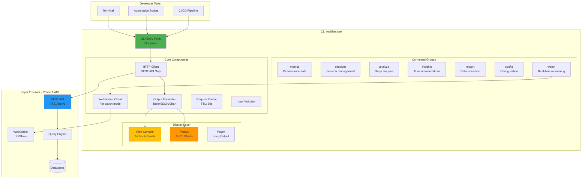

<!--
Copyright © 2025 Sierra Labs LLC
SPDX-License-Identifier: AGPL-3.0-only
License-Filename: LICENSE
-->

# Layer 3: CLI Interface

> Command Line Interface for Blueplane Telemetry System
> Part of the Blueplane MVP Architecture
> [Back to Main Architecture](./BLUEPLANE_MVP_ARCHITECTURE.md)

---

## Overview

The Blueplane CLI provides developers with **direct terminal access** to telemetry data, enabling quick metrics checks, session analysis, and data export without leaving the command line. Built with modern Python tooling using `uv` for dependency management and `rich` for beautiful terminal output.

## Architecture

The CLI tool uses **REST API exclusively** for all operations, providing a simple and efficient interface for terminal-based telemetry access. WebSocket support is only used for the `watch` command's real-time monitoring.



### API Usage Pattern

The CLI uses **simple REST endpoints** for all operations:

| Command | REST Endpoint | Method | Purpose |
|---------|--------------|--------|---------|
| `metrics` | `/api/v1/metrics` | GET | Query metrics |
| `sessions` | `/api/v1/sessions` | GET | List sessions |
| `analyze` | `/api/v1/sessions/{id}/analysis` | GET | Deep analysis |
| `insights` | `/api/v1/insights` | GET | Get insights |
| `export` | `/api/v1/export` | GET | Export data |
| `config` | `/api/v1/config` | GET/POST | Manage config |
| `watch` | `/ws/metrics` or `/ws/events` | WS | Real-time stream |

## Installation

### Global Installation with uv

```bash
# Install as a global tool
uv tool install blueplane-cli

# Or install from local path
uv tool install ~/.blueplane/cli/

# Verify installation
blueplane --version
```

### Development Installation

```bash
# Navigate to CLI source directory and install in development mode
cd blueplane-telemetry-core/src/cli
uv venv
uv pip install -e .
```

### Shell Completion

```bash
# Bash
blueplane --install-completion bash

# Zsh
blueplane --install-completion zsh

# Fish
blueplane --install-completion fish
```

## Commands

### Core Commands Overview

| Command    | Description                     | Example                                  |
| ---------- | ------------------------------- | ---------------------------------------- |
| `metrics`  | Display performance metrics     | `blueplane metrics --period 24h`         |
| `sessions` | List and manage sessions        | `blueplane sessions -n 20`               |
| `analyze`  | Deep dive into specific session | `blueplane analyze sess_abc123`          |
| `insights` | Get AI-powered recommendations  | `blueplane insights --type productivity` |
| `export`   | Export data for analysis        | `blueplane export -f csv -o data.csv`    |
| `config`   | Manage configuration            | `blueplane config --list`                |
| `watch`    | Real-time monitoring            | `blueplane watch --metrics`              |

### Detailed Command Reference

#### `blueplane metrics`

Display metrics for current or historical sessions.

```bash
# Current session metrics
blueplane metrics

# Specific time period
blueplane metrics --period 7d

# Specific session
blueplane metrics --session sess_xyz789

# Different output formats
blueplane metrics --format json
blueplane metrics --format chart
blueplane metrics --format table  # default

# Group by dimension
blueplane metrics --group-by platform
blueplane metrics --group-by project
```

**Options:**

- `--session, -s`: Specific session ID (default: current)
- `--period, -p`: Time period (1h, 24h, 7d, 30d)
- `--format, -f`: Output format (table, json, chart)
- `--group-by`: Grouping dimension
- `--include-trends`: Show trend indicators

#### `blueplane sessions`

List and filter coding sessions.

```bash
# List recent sessions
blueplane sessions

# Filter by platform
blueplane sessions --platform claude
blueplane sessions --platform cursor

# Filter by project
blueplane sessions --project abc123

# Performance filters
blueplane sessions --min-acceptance 0.7
blueplane sessions --min-productivity 100

# Time filters
blueplane sessions --since "2025-11-01"
blueplane sessions --until "2025-11-07"

# Pagination
blueplane sessions --limit 50 --offset 20
```

**Options:**

- `--limit, -n`: Number of sessions to show (default: 10)
- `--platform, -p`: Filter by platform (all, claude, cursor)
- `--project`: Filter by project hash
- `--min-acceptance`: Minimum acceptance rate
- `--min-productivity`: Minimum productivity score
- `--since`: Start date filter
- `--until`: End date filter

#### `blueplane analyze`

Deep analysis of a specific session.

```bash
# Basic analysis
blueplane analyze sess_abc123

# Verbose mode with timeline
blueplane analyze sess_abc123 --verbose

# Include tool breakdown
blueplane analyze sess_abc123 --tools

# Include file changes
blueplane analyze sess_abc123 --files

# Export analysis
blueplane analyze sess_abc123 --export analysis.json
```

**Options:**

- `--verbose, -v`: Include detailed timeline
- `--tools`: Show tool usage breakdown
- `--files`: Show file modification details
- `--insights`: Include AI insights
- `--export`: Export analysis to file

#### `blueplane insights`

Get AI-powered insights and recommendations.

```bash
# Productivity insights
blueplane insights --type productivity

# Error pattern analysis
blueplane insights --type errors

# Usage patterns
blueplane insights --type patterns

# Context-specific insights
blueplane insights --session sess_abc123

# Team insights (requires cloud sync)
blueplane insights --team
```

**Options:**

- `--type, -t`: Insight type (productivity, errors, patterns)
- `--session, -s`: Session context
- `--priority`: Filter by priority (high, medium, low)
- `--actionable`: Only show actionable insights

#### `blueplane export`

Export telemetry data for external analysis.

```bash
# Export to CSV
blueplane export -f csv -o metrics.csv

# Export to JSON
blueplane export -f json -o data.json

# Export to Parquet for data science
blueplane export -f parquet -o telemetry.parquet

# Date range export
blueplane export -f csv -o weekly.csv --start 2025-11-01 --end 2025-11-07

# Filtered export
blueplane export -f json -o claude_sessions.json --filter platform=claude

# Anonymized export for sharing
blueplane export -f json -o anonymous.json --anonymize
```

**Options:**

- `--format, -f`: Export format (csv, json, parquet)
- `--output, -o`: Output file path
- `--start`: Start date (YYYY-MM-DD)
- `--end`: End date (YYYY-MM-DD)
- `--filter`: Filter expressions
- `--anonymize`: Remove identifying information

#### `blueplane config`

Manage telemetry configuration.

```bash
# List all configuration
blueplane config --list

# Get specific value
blueplane config --get telemetry.enabled

# Set configuration value
blueplane config --set telemetry.acceptance_threshold 0.7

# Reset to defaults
blueplane config --reset

# Export configuration
blueplane config --export config.yaml

# Import configuration
blueplane config --import config.yaml
```

**Options:**

- `--list`: Show all configuration values
- `--get`: Get specific configuration key
- `--set`: Set key-value pair
- `--reset`: Reset to default values
- `--export`: Export configuration to file
- `--import`: Import configuration from file

#### `blueplane watch`

Real-time monitoring dashboard.

```bash
# Watch current metrics
blueplane watch --metrics

# Watch session events
blueplane watch --events

# Watch specific session
blueplane watch --session sess_abc123

# Custom refresh interval
blueplane watch --metrics --interval 5
```

**Options:**

- `--metrics`: Watch metrics dashboard
- `--events`: Watch event stream
- `--session`: Specific session to watch
- `--interval`: Refresh interval in seconds

## Output Formats

### Table Format (Default)

Beautiful tables using Rich:

```
┏━━━━━━━━━━━━━━━━━━┳━━━━━━━━━┳━━━━━━━━┓
┃ Metric           ┃ Value   ┃ Change ┃
┡━━━━━━━━━━━━━━━━━━╇━━━━━━━━━╇━━━━━━━━┩
│ Acceptance Rate  │ 78.3%   │ +2.1%  │
│ Productivity     │ 145     │ +12    │
│ Error Rate       │ 3.2%    │ -0.5%  │
│ Lines Added      │ 523     │ +78    │
│ Tools Used       │ 47      │ +5     │
└──────────────────┴─────────┴────────┘
```

### Chart Format

ASCII charts using Plotext:

```
Acceptance Rate - Last 7 Days
    100% ┤
     95% ┤    ╭─╮
     90% ┤   ╱  ╰╮
     85% ┤  ╱    ╰─╮
     80% ┤ ╱       ╰─╮
     75% ┤╱          ╰
         └────────────────
         Mon  Wed  Fri  Sun
```

### JSON Format

Structured JSON for scripting:

```json
{
  "metrics": {
    "acceptance_rate": 0.783,
    "productivity_score": 145,
    "error_rate": 0.032,
    "lines_added": 523,
    "tools_used": 47
  },
  "trends": {
    "acceptance_rate": { "direction": "up", "change": 0.021 },
    "productivity_score": { "direction": "up", "change": 12 }
  }
}
```

## Configuration

### Configuration File

Located at `~/.blueplane/cli/config.yaml`:

```yaml
# CLI Configuration
server:
  url: http://localhost:7531
  timeout: 30
  retry: 3

display:
  format: table # table, json, chart
  color: true
  pager: auto # auto, always, never
  max_width: 120

cache:
  enabled: true
  ttl: 60 # seconds
  size: 1000 # entries

telemetry:
  acceptance_threshold: 0.7
  productivity_baseline: 100

export:
  default_format: json
  anonymize: false

watch:
  refresh_interval: 5 # seconds
  metrics_dashboard: true
  event_stream: false
```

### Environment Variables

```bash
# Override server URL
export BLUEPLANE_SERVER=http://localhost:7531

# Disable colored output
export NO_COLOR=1

# Set default output format
export BLUEPLANE_FORMAT=json

# Enable debug logging
export BLUEPLANE_DEBUG=1
```

## Usage Examples

### Interactive Session Analysis

```bash
# Start interactive analysis
blueplane repl

>>> metrics --period 1h
>>> sessions --limit 5
>>> analyze sess_abc123
>>> insights
>>> exit
```

### Automation Scripts

```bash
#!/bin/bash
# daily_report.sh

# Generate daily metrics report
DATE=$(date +%Y-%m-%d)
OUTPUT_DIR="/reports/$DATE"

mkdir -p "$OUTPUT_DIR"

# Export metrics
blueplane export -f csv -o "$OUTPUT_DIR/metrics.csv" --start "$DATE"

# Get insights
blueplane insights --type productivity > "$OUTPUT_DIR/insights.txt"

# Generate charts
blueplane metrics --format chart > "$OUTPUT_DIR/charts.txt"

# Email report
mail -s "Daily Telemetry Report" team@company.com < "$OUTPUT_DIR/insights.txt"
```

### CI/CD Integration

```yaml
# .github/workflows/telemetry.yml
name: Telemetry Analysis

on:
  push:
    branches: [main]

jobs:
  analyze:
    runs-on: ubuntu-latest
    steps:
      - uses: actions/checkout@v2

      - name: Install Blueplane CLI
        run: |
          curl -LsSf https://astral.sh/uv/install.sh | sh
          uv tool install blueplane-cli

      - name: Analyze Code Quality Metrics
        run: |
          blueplane metrics --period 7d --format json > metrics.json

      - name: Check Acceptance Rate
        run: |
          RATE=$(blueplane metrics --format json | jq '.acceptance_rate')
          if (( $(echo "$RATE < 0.6" | bc -l) )); then
            echo "Warning: Low acceptance rate: $RATE"
            exit 1
          fi
```

### Python Integration

```python
# analyze_productivity.py (pseudocode example)

def get_metrics(period="7d"):
    """
    Get metrics via CLI subprocess call.
    - Run: blueplane metrics --format json --period {period}
    - Parse JSON output
    """

def analyze_trends():
    """
    Analyze productivity trends from current vs previous week.
    - Get current and previous period metrics
    - Calculate deltas for acceptance_rate and productivity_score
    - Print comparison report
    - Get AI insights if metrics declining
    """
```

## Performance

### Optimization Features

1. **Response Caching**: 60-second TTL cache for repeated queries
2. **Parallel Requests**: Concurrent API calls for multi-resource queries
3. **Streaming Output**: Progressive rendering for large datasets
4. **Lazy Loading**: On-demand data fetching
5. **Compression**: Gzip compression for API responses

### Benchmarks

| Operation         | Time   | Notes                    |
| ----------------- | ------ | ------------------------ |
| `metrics`         | <100ms | Cached after first call  |
| `sessions -n 100` | <500ms | Paginated loading        |
| `analyze`         | <1s    | Includes all sub-queries |
| `export` (1GB)    | <10s   | Streaming export         |

## Error Handling

### Common Issues and Solutions

```bash
# Connection error
Error: Cannot connect to Layer 2 server at localhost:7531
Solution: Ensure Layer 2 server is running: systemctl status blueplane-server

# Authentication error
Error: Invalid API key
Solution: Update configuration: blueplane config --set api.key YOUR_KEY

# Timeout error
Error: Request timeout after 30s
Solution: Increase timeout: blueplane config --set server.timeout 60

# No data available
Error: No sessions found for specified criteria
Solution: Check filters or expand time range
```

### Debug Mode

```bash
# Enable debug output
BLUEPLANE_DEBUG=1 blueplane metrics

# Verbose logging
blueplane --verbose metrics

# Dry run (show API calls without executing)
blueplane --dry-run export -f csv -o test.csv
```

## Advanced Features

### Custom Formatters

```python
# ~/.blueplane/cli/formatters/custom.py (pseudocode example)

class CustomFormatter(BaseFormatter):
    """
    Custom output formatter.
    - Inherit from BaseFormatter
    - Override format_metrics() with custom logic
    - Register via: blueplane config --set formatters.custom <path>
    """
```

### Plugin System

```bash
# Install plugin
blueplane plugin install github-integration

# List plugins
blueplane plugin list

# Configure plugin
blueplane plugin config github-integration --token YOUR_TOKEN
```

### Aliases

```bash
# Create command aliases
blueplane alias create daily "metrics --period 24h --format table"
blueplane alias create weekly-export "export -f csv --start -7d"

# Use aliases
blueplane daily
blueplane weekly-export -o report.csv
```

## Security

### Access Control

- **Local Mode**: No authentication required for local server
- **Remote Mode**: API key authentication for remote servers
- **Session Isolation**: Each user has isolated session data
- **Audit Logging**: All commands logged to `~/.blueplane/cli/audit.log`

### Data Privacy

- **No Code Transmission**: CLI never sends source code
- **Local Storage**: All data stored locally unless explicitly exported
- **Anonymization**: Built-in anonymization for data sharing

## Troubleshooting

### Diagnostic Commands

```bash
# Check system status
blueplane doctor

# Test server connection
blueplane ping

# Verify configuration
blueplane config --validate

# Clear cache
blueplane cache --clear

# Reset to defaults
blueplane reset --all
```

## Future Enhancements

1. **Interactive Mode**:

   - REPL interface for exploration
   - Tab completion for all commands
   - Context-aware suggestions

2. **Visualization Improvements**:

   - Terminal-based dashboards
   - Real-time streaming charts
   - Heatmap visualizations

3. **Integration Features**:

   - Direct IDE integration
   - Git hooks for automated analysis
   - Slack/Discord notifications

4. **Advanced Analytics**:
   - Predictive metrics
   - Anomaly detection
   - Team comparison tools

---

[Back to Main Architecture](./BLUEPLANE_MVP_ARCHITECTURE.md) | [MCP Server Specification](./layer3_mcp_server.md)
